# Autopilot v2 Architecture

## Context

Autopilot v1 is a custom TypeScript orchestration loop that uses Linear as its source of truth and spawns Claude Code agents to implement issues. It works, but has fundamental gaps:

1. **No institutional memory** — agents wake up with no knowledge of past decisions, why things were built, or what constraints exist. Reasoning dies with the context window.
2. **No cross-agent coherence** — 10 parallel agents can build overlapping, architecturally inconsistent systems. Merges succeed because git conflicts resolve, not because designs align.
3. **No temporal reasoning** — decisions made at a point in time based on what was needed and possible are never revisited when circumstances change.

v2 keeps the orchestration layer simple (it's plumbing, not product), replaces Linear with Beads, adds a knowledge graph for institutional memory, introduces a CTO agent role for architectural coherence, and adds inter-agent communication. The prompts and plugins — the real product — survive and evolve.

**v3 may adopt Gastown** (Steve Yegge's multi-agent orchestration) for the orchestration layer. We don't see high value in owning orchestration plumbing long-term — but Gastown's sandboxing story (ExitBox) is immature, its tmux-based session model loses our Agent SDK advantages (programmatic MCP injection, bubblewrap sandbox, credential isolation, per-agent plugin scoping, activity streaming), and the Dolt dependency is heavy. When Gastown matures, migrating should be straightforward — our prompts, plugins, and knowledge graph are portable. See [Appendix: Gastown Evaluation](#appendix-gastown-evaluation) for the full analysis.

## The Stack

```
┌─────────────────────────────────────────────────────────────┐
│                    Knowledge Layer                           │
│                                                              │
│  Agentic Memory (MCP server)                                 │
│  - Knowledge graph: entities, relationships, observations    │
│  - Hybrid search: BM25 + semantic + graph traversal          │
│  - Decision artifacts, component models, pattern records     │
│  - Temporal: when decisions were made, what invalidates them │
│  - All agents read from and write to this layer              │
└──────────────────────────┬───────────────────────────────────┘
                           │
┌──────────────────────────┴───────────────────────────────────┐
│                      Task Layer                               │
│                                                               │
│  Beads (bd)                                                   │
│  - Replaces Linear as source of truth                         │
│  - Dolt-backed (git-like model for SQL data)                  │
│  - Hash IDs (no merge collisions)                             │
│  - bd ready / bd claim / bd close                             │
│  - Hierarchical: epics → tasks → sub-tasks                    │
│  - Formulas for repeatable workflows                          │
└──────────────────────────┬───────────────────────────────────┘
                           │
┌──────────────────────────┴───────────────────────────────────┐
│                  Orchestration Layer                           │
│                                                               │
│  Our TypeScript loop (simplified from v1)                     │
│  - Agent SDK query() with sandbox + MCP injection             │
│  - Per-agent plugins and tool scoping                         │
│  - Inter-agent mail (beads message type, exposed via MCP tools) │
│  - Budget tracking, slot management                           │
│  - Activity streaming to dashboard                            │
│  - Built-in worktrees (replaces shared clones)                │
│  - Intentionally simple — v3 may hand this to Gastown         │
└──────────────────────────┬───────────────────────────────────┘
                           │
┌──────────────────────────┴───────────────────────────────────┐
│                     Agent Layer                               │
│                                                               │
│  Claude Code agents with specialized roles                    │
│  - Each agent gets: task (bead) + architectural context       │
│    (from knowledge graph) + concurrent awareness (via mail)   │
│  - Agents write decisions back to knowledge graph             │
│  - Ephemeral sessions, persistent knowledge                   │
└───────────────────────────────────────────────────────────────┘
```

## Part 1: What We're Building

### 1. Beads Replaces Linear

Beads (`bd`) is a Dolt-backed issue tracker. It replaces Linear as the source of truth for task management.

**Why switch:**
- Local-first — tasks live alongside the repo in `.beads/dolt/`, not in a SaaS API. Dolt uses a git-like model (commits, branches, merges) for SQL data, synced via `bd dolt push/pull`. The Dolt database is gitignored; JSONL exports can optionally be committed to git for portability.
- Hash-based IDs — no collision risk with parallel agents
- Dependency graph — `bd dep add` creates proper blocking relationships
- `bd ready` / `bd claim` / `bd close` — clean state machine for agent workflows
- No API key management — no `LINEAR_API_KEY`, no MCP server for issue tracking
- Works offline, works in CI, works in any worktree

**Storage and access model:**

Beads stores data in `.beads/dolt/` in the **project root** (shared across all agents). A local Dolt SQL server process serves all reads/writes. Agents access beads through MCP tools on the autopilot server — they never talk to Dolt directly. This keeps the sandbox clean (no Dolt network access, no `bd` binary needed in worktrees) and gives the orchestration layer an audit/validation point.

MCP tools (~6 total): `list_ready_beads`, `claim_bead`, `update_bead`, `close_bead`, `get_bead`, `search_beads`. Under the hood, the orchestration shells out to `bd` against the shared database.

**Dependency traversal:** `bd ready` natively handles blocking dependencies (issues with open `blocks` deps are excluded) and parent-child hierarchy (children blocked if parent is blocked). In v1 we built this manually in `getReadyIssues()` — filtering for leaf issues with no incomplete blockers. The `list_ready_beads` MCP tool wraps `bd ready` and adds leaf-only filtering if beads doesn't skip parents with open children natively (needs verification).

**Team use:** For teams, Dolt replication syncs the beads database across machines. `bd init --team` sets up shared sync; `bd dolt push/pull` keeps everyone current. DoltHub (GitHub-for-Dolt) provides hosted remotes and a web UI for browsing beads. Teammates create beads from their machines, autopilot claims and works on them, status changes replicate back.

```
Teammates ←→ Dolt remote (DoltHub / self-hosted) ←→ Local Dolt server ←→ MCP tools ←→ Agents
```

For solo use, no remote is needed — everything stays local.

**What changes in the codebase:**

| v1 | v2 |
|---|---|
| `src/lib/linear.ts` (~700 lines) | Beads MCP tools on autopilot server |
| Linear MCP server (HTTP) | Replaced by beads tools on autopilot MCP |
| `getReadyIssues()`, `updateIssue()` | `list_ready_beads`, `update_bead`, `close_bead` |
| Issue state via Linear API | Bead state via MCP tools (backed by `bd` CLI) |
| `withRetry()` for Linear calls | Not needed — `bd` operates on local Dolt |
| Label-based ownership (`autopilot:managed`) | Bead metadata or tags |

**What stays the same:**
- Our orchestration loop polls for ready work and spawns agents
- Agents still get a task ID, implement it, push a PR, update status
- The prompts define the workflow — they just use beads MCP tools instead of Linear MCP

### 2. Knowledge Graph (Institutional Memory)

The knowledge graph is the most important new component. It provides persistent, structured, queryable memory that outlives any individual agent session.

**Decision: gk v2** — a rewrite of [gk](~/Builds/gk) (our own project) in TypeScript with pluggable SQLite/Dolt backend, Hebbian strengthening + Ebbinghaus decay for temporal dynamics, and no Ollama dependency. Full spec at `~/Builds/gk/v2.md`.

#### Why gk

We evaluated gk, Engram (199-bio), Google's always-on-memory-agent, Dolt-native agentic memory, mcp-memory-service, and the broader landscape (agent-recall, Cognee, Smriti, Mnemon). Key findings:

- **gk has the right data model** — entity-relationship-observation triples with dynamic schema, 3-tier MCP tool design, domain guides that teach agents how to use it well
- **Engram has the right temporal dynamics** — Hebbian strengthening (usage reinforces relevance) and Ebbinghaus decay (unused knowledge fades). Its consolidation pipeline (episodes → memories → digests via Opus) is unnecessary when agents write structured knowledge at write time
- **Dolt gives us versioning for free** — every `dolt commit` snapshots the knowledge graph. `dolt diff` shows what changed between planning cycles. `dolt log` shows when decisions were added. Temporal awareness without custom staleness tracking
- **Vector search is unnecessary** — agent queries are structured (specific entities, modules, patterns, decisions), not fuzzy semantic similarity. FTS + graph traversal covers 90%+ of real queries. No embedding model dependency

gk v2 = gk's model + Engram's temporal dynamics + Dolt backend. No Ollama, no vector search, no consolidation.

#### Schema (Dolt tables, same instance as beads)

```sql
CREATE TABLE kg_entities (
  id VARCHAR(64) PRIMARY KEY,
  name VARCHAR(256) NOT NULL,
  type VARCHAR(64) NOT NULL,           -- decision, component, pattern, constraint, or agent-defined (autopilot adds: roadmap)
  properties JSON,
  confidence FLOAT DEFAULT 0.8,
  staleness_tier VARCHAR(16) DEFAULT 'detail',  -- detail/summary/overview (pyramid model)
  access_count INT DEFAULT 0,                    -- Hebbian: usage strengthens relevance
  last_accessed TIMESTAMP,                       -- Ebbinghaus: decay from last access
  created_at TIMESTAMP DEFAULT CURRENT_TIMESTAMP,
  updated_at TIMESTAMP DEFAULT CURRENT_TIMESTAMP,
  FULLTEXT INDEX ft_name (name)
);

CREATE TABLE kg_observations (
  id VARCHAR(64) PRIMARY KEY,
  entity_id VARCHAR(64) NOT NULL,
  content TEXT NOT NULL,
  confidence FLOAT DEFAULT 0.8,
  source VARCHAR(128),                 -- agent ID, planning session, etc.
  access_count INT DEFAULT 0,
  last_accessed TIMESTAMP,
  created_at TIMESTAMP DEFAULT CURRENT_TIMESTAMP,
  FOREIGN KEY (entity_id) REFERENCES kg_entities(id),
  FULLTEXT INDEX ft_content (content)
);

CREATE TABLE kg_relationships (
  id VARCHAR(64) PRIMARY KEY,
  from_entity VARCHAR(64) NOT NULL,
  to_entity VARCHAR(64) NOT NULL,
  type VARCHAR(64) NOT NULL,           -- affects, constrains, depends_on, decided_by
  properties JSON,
  strength FLOAT DEFAULT 1.0,          -- Hebbian: traversal strengthens relationships
  created_at TIMESTAMP DEFAULT CURRENT_TIMESTAMP,
  FOREIGN KEY (from_entity) REFERENCES kg_entities(id),
  FOREIGN KEY (to_entity) REFERENCES kg_entities(id)
);
```

#### Temporal Dynamics

**Hebbian strengthening:** Every read operation (search, get_entity, get_neighbors) automatically bumps `access_count` and `last_accessed`. Relationships gain `strength` when traversed. No agent effort needed — usage patterns emerge organically.

**Ebbinghaus decay:** Knowledge that nobody queries fades in retrieval ranking. Not deleted — just deprioritized. Combined with pyramid tiers (overview ages slow, details age fast).

**Scoring formula:**
```
score = text_relevance × recency_weight × (1 + log(access_count + 1)) × tier_weight
```
- `text_relevance` = FTS match score (BM25)
- `recency_weight` = exponential decay from `last_accessed` (configurable half-life)
- `tier_weight` = overview: 1.0, summary: 0.7, detail: 0.4

**No consolidation.** Agents write structured knowledge at write time. The CTO's post-flight review reads, validates, and adjusts confidence — but that's review, not a consolidation pipeline.

#### What Gets Stored

Two categories of knowledge, with different lifecycles:

**Strategic knowledge** — roadmap, plans, motivation. Written during planning, completion inferred from linked beads.

```
Entity: "Add caching layer to API responses"
  type: roadmap, tier: overview
  Observations:
    - "API latency complaints identified in Q1 security audit" (confidence: 0.9)
    - "Target: sub-100ms p99 for cached endpoints" (confidence: 0.8)
  Relationships:
    - implemented_by → bd-a3f8          ← bead status = completion signal
    - motivated_by → "Q1 Security Audit"
    - affects → "server.ts request pipeline"
```

When `bd-a3f8` closes, the roadmap item is done — no knowledge graph update needed. Query "what's on the roadmap?" by following `implemented_by` links and checking bead status. One source of truth (beads), not two.

**Technical knowledge** — decisions, components, patterns, constraints. Written during and after implementation, curated by CTO.

```
Entity: "Use SQLite for agent run storage"
  type: decision, tier: overview
  Observations:
    - "Chosen because single-node deployment, no external DB dependency" (confidence: 0.9)
    - "Invalidation condition: if we need multi-node or concurrent writes" (confidence: 0.8)
  Relationships:
    - affects → "db.ts module"
    - decided_by → "Planning session 2026-01-15"
```

**Components** (`type=component`, `tier=summary`), **Patterns** (`type=pattern`, `tier=summary`), **Constraints** (`type=constraint`, `tier=overview`) — same structure with appropriate tier defaults.

#### Knowledge Graph Write Lifecycle

The graph is a living thing, updated at multiple points — not just after work is done.

| Timing | Who writes | What | Confidence |
|--------|-----------|------|-----------|
| **Planning** | CTO | Roadmap entities with `implemented_by` links to new beads. Architectural constraints for the batch. | High — deliberate decisions |
| **Pre-flight** | CTO | Batch-specific contracts: "bd-x1 must add rate limiting BEFORE auth middleware" | High — constraints for agents |
| **During work** | Engineer | "Taking approach X because Y", component relationships discovered | Low-Medium (0.5-0.7) — may pivot |
| **Work complete** (before PR) | Engineer | What was actually built, technical decisions made | Medium (0.7-0.8) |
| **Post-flight** (batch ends) | CTO | Curate: validate engineer observations, elevate patterns, prune noise, adjust confidence, cross-reference across batch | High — ground truth |

**Strategic knowledge** is written at planning time and never needs "completion" updates — completion is inferred from bead status via `implemented_by` relationships.

**Technical knowledge** accumulates during work and gets curated at post-flight. The CTO's post-flight is the natural curation point, not a separate consolidation step.

Specialist reports (Scout findings, Security audit results) are **mail to the CTO**, not knowledge graph entries. The CTO synthesizes them into planning documents and knowledge graph entities. Specialist outputs are ephemeral coordination; the CTO's synthesis is the institutional memory.

#### How Agents Interact With It

**CTO planning** (strategic writes):
```
# Create roadmap entity linked to new beads
record_roadmap({
  name: "Add caching layer to API responses",
  motivation: "Q1 latency findings",
  implemented_by: "bd-a3f8",
  affects: ["server.ts request pipeline"]
})
```

**CTO pre-flight** (batch contracts):
```
search_hybrid("authentication middleware session handling")
get_relationships(entity="auth module")
→ Produces architectural contract, writes constraints to graph
```

**Engineer during work** (tentative observations):
```
record_decision({
  name: "Use Map for in-memory fixer tracking",
  observations: ["Chose Map over SQLite because data is ephemeral"],
  relationships: [{ to: "monitor.ts", type: "implemented_in" }],
  confidence: 0.7
})
```

**CTO post-flight** (curation):
```
# Review batch observations, elevate/prune
get_neighbors("auth module", depth=2)
bulk_update_confidence([
  { entity: "Use JWT for sessions", confidence: 0.95 },  # confirmed by implementation
  { entity: "Consider Redis caching", confidence: 0.3 },  # didn't pan out
])
```

#### MCP Tool Surface

gk v2 runs as a standalone MCP server. Autopilot injects it into agents alongside beads and GitHub MCP servers.

**Tier 1 (Foundation):** `add_entities`, `add_observations`, `add_relationships`, `search_hybrid`, `get_entity`, `get_neighbors`, `get_relationships`, `update_entity`, `delete_entity`

**Tier 2 (Maintenance):** `prune_stale`, `get_health_report`, `merge_entities`, `bulk_update_confidence`

No domain sugar tools (v1's `record_decision`, `record_pattern`, etc.) — entity types and conventions are handled by skills/guides, not separate tools. Skills teach agents "use `type: decision` with `tier: overview`" rather than wrapping that in a dedicated tool.

**Domain guides** (skills loaded into agents): extraction, query, review, pyramid — teach agents how to use the knowledge graph effectively. These are the real product. Autopilot-specific conventions (e.g. "use `type: roadmap` with `implemented_by` links to beads") live in autopilot's own skills, not in gk's generic guides.

#### Standalone vs Autopilot

gk v2 is a standalone project (`~/Builds/gk`). Pluggable backend:
- **Standalone:** SQLite + FTS5, `gk init` creates a local file, zero dependencies
- **Autopilot:** Dolt backend, shares the instance running for beads (port 3307)

This means gk's release cycle is independent. Bug fixes, scoring tweaks, new tools — all ship as gk updates without touching autopilot.

### 3. CTO Agent + Review Legs (Architectural Coherence)

#### The Problem

v1 has a flat structure: CTO plans, executors execute, monitor watches. There's no cross-agent awareness. Agent 1 adds a caching layer to `server.ts` while Agent 2 refactors the request pipeline — both succeed locally but create an incoherent system that git-merges but doesn't make architectural sense.

#### The CTO Agent

A persistent agent role (runs as part of the orchestration loop, not a one-off) that maintains architectural coherence. Operates through the knowledge graph, never through source code.

**Pre-flight review** (before agents start a batch of work):
1. For each bead in the batch: query knowledge graph for related decisions/patterns/constraints
2. Detect conflicts: two beads changing the same module incompatibly, beads violating existing constraints
3. Write an **architectural contract** — context each agent receives via mail before starting

**Post-flight** (after a batch completes):
1. Curate the knowledge graph — validate engineer observations, elevate patterns, prune noise, adjust confidence
2. Read batch summary from Staff Engineer (via mail) — what was approved, blocked, escalated
3. Handle escalations — systemic issues the Staff Engineer flagged
4. Update roadmap knowledge — link completed work to strategic entities

**The CTO does NOT review PRs, read diffs, or approve individual changes.** This is deliberate. The CTO operates at the strategic/architectural level. PR review is the Staff Engineer's job. If the CTO is reading `server.ts`, something went wrong.

The CTO's inputs are:
- Knowledge graph queries (decisions, components, patterns, constraints)
- Bead descriptions (what each task intends to change)
- Staff Engineer summaries (batch results, escalations)
- Agent observations written to knowledge graph during work

#### Conditional Review Legs

The Staff Engineer decides which specialist review legs to trigger for each PR, based on what changed:

| PR touches... | Triggers |
|---|---|
| Multiple subsystems | Architect review (always) |
| Auth, crypto, permissions, user data | Security review |
| User-facing behavior, new features, API changes | Product review |
| Core infrastructure, data layer, performance | QA review |
| Single file, isolated bugfix | Staff Engineer only (lightweight) |

Review legs are ephemeral agents spawned by the Staff Engineer, running in parallel. Verdicts flow back to the Staff Engineer, who makes the approve/block decision. Systemic concerns get escalated to CTO via mail.

#### Decision Authority and Pushback

Agents at each level should have opinions grounded in the knowledge graph and the authority to push back with evidence — but within a clear chain of command that prevents endless debate.

**The one-pushback rule:** When you receive direction that conflicts with what you know (from the knowledge graph, from in-flight work, from past decisions), you push back **once** with evidence. If your superior acknowledges and reaffirms, you execute. No relitigating.

**The principle: disagree and commit.** You can raise concerns once with evidence. After that, you commit fully. "Complain and don't commit" is a firing offense — an agent that drags its feet or half-implements something it disagrees with is worse than one that does nothing.

**Authority flows down, evidence flows up:**

| Level | Can push back on | Pushes back to | Limit |
|---|---|---|---|
| Human (Mayor/CEO) | Nobody | — | — |
| CTO | Human's beads | Human | Once with evidence |
| Product Manager | Human's priorities | Human | Once with evidence |
| Tech Lead | CTO's decomposition | CTO | Once with evidence |
| Engineer | Tech Lead's approach | Tech Lead (via bead notes) | Once with evidence |

**The directive escape hatch:** For genuine pivots, the human can mark a bead as a `directive`. This signals: don't evaluate whether to do it, evaluate how. Normal beads get merit-based review. Directives get execution planning.

#### Why This Scales

An agent CTO with a well-maintained knowledge graph doesn't have human memory bottlenecks. Pre-flight review for a batch of 10 beads:

1. For each bead: `search_hybrid("<bead summary>")` → relevant decisions
2. `get_neighbors("<affected modules>")` → blast radius + concurrent work
3. Cross-reference for conflicts
4. Produce architectural contract

That's seconds, not hours. **The scaling limit is the quality of the knowledge graph, not the CTO's attention.** If engineers record decisions in the knowledge graph, the CTO's queries return useful results. If they skip it, the graph decays.

### 4. Inter-Agent Mail

Agents need to communicate: the CTO sends architectural contracts to engineers, engineers escalate design concerns to the CTO, the review-responder reports human reviewer feedback.

v1 has no inter-agent communication. Agents are fully isolated — they don't know about each other. This works for simple parallel execution but breaks down with the CTO role.

#### Implementation

Mail uses beads' built-in message type — no custom Dolt table needed. Beads separates data plane (stores messages as issues) from control plane (orchestration handles routing/delivery), which matches our `deliverMail()` pattern exactly.

A message is a bead with `type: message`:

| Field | Maps to |
|-------|---------|
| `type` | `message` |
| `sender` | From agent (role name) |
| `assignee` | Recipient (role name) |
| `title` | Subject line |
| `description` | Message body |
| `status` | `open` (unread) / `closed` (read/handled) |
| `ephemeral` | `true` — eligible for bulk cleanup |
| Threading | `replies_to` dependency links |

```bash
# Send a message
bd create "Architectural contract for batch X" --type message \
  --assignee cto --json

# Reply in thread
bd create "Acknowledged, proceeding with constraints" --type message \
  --assignee engineer --json
bd dep add <reply-id> <original-id> --type replies_to

# Check inbox
bd list --type message --status open --assignee cto --json

# Mark as handled
bd close <message-id> --reason "Processed"
```

Agents don't call `bd` directly — these are wrapped as MCP tools on the autopilot server:
- `send_mail(to, subject, body)` — creates a message bead assigned to recipient
- `send_and_wait(to, subject, body, timeout?)` — sends and polls for `replies_to` child. Agent pauses cheaply (DB poll, not token burn). Falls back on timeout.
- `check_inbox()` — `bd list --type message --status open --assignee <self>`
- `reply_mail(id, body)` — creates reply message + `replies_to` dependency
- `archive_mail(id)` — `bd close <id>`

Ephemeral messages are cleaned up periodically — mail is coordination, not permanent record. Decisions worth keeping go in the knowledge graph.

If we move to Gastown in v3, migrating to `gt mail` is straightforward — Gastown uses the same beads message type with the same semantics.

#### Message Flows

```
CTO pre-flight:
  CTO → Engineers: "Architectural contract for batch X"

Engineer escalation:
  Engineer → CTO: "This bead conflicts with decision X in knowledge graph"

PR Maintenance escalation:
  PR Maintenance → CTO: "Human reviewer raised a design concern on PR #42"

CTO post-flight:
  CTO → Orchestration: "APPROVE bd-x1, BLOCK bd-x3"
```

#### Orchestration: Mail Delivery Loop

Mail delivery is a dedicated step in the TypeScript orchestration loop — separate from fillSlots, checkOpenPRs, and planning. The orchestration checks for unread messages and spawns recipients to handle them. Agents don't poll their own mail (that would burn tokens on empty inbox checks).

```
every poll_interval:
  1. fillSlots()          — spawn engineers for ready beads
  2. checkOpenPRs()       — spawn PR maintenance for CI failures
  3. deliverMail()         — check for unread messages, spawn recipients
  4. checkPlanningNeeded() — spawn CTO for planning cycle
```

`deliverMail()` queries beads for unread messages (`bd list --type message --status open --json`), groups by recipient role, and spawns each recipient once with their pending messages as context:

- **CTO has 3 unread messages** → spawn CTO (persona + inbox-dispatch task + messages)
- **No unread mail for anyone** → no-op (a SQL query, not an agent invocation)

Each step is independent. An engineer working on a bead doesn't check mail — if it sends a message to the CTO, that message sits in the table until the next `deliverMail()` iteration spawns the CTO to handle it. No waiting, no doubling up with other prompt types.

Mail-spawned agents count against the slot budget like any other agent. The orchestration decides when and whether to spawn based on available slots and priority (urgent mail can preempt non-urgent work).

#### In-flight mail: waiting and interrupts

Agents can choose to wait on a response during execution. An engineer that needs CTO guidance calls `send_and_wait()` — sends a message bead and polls for a `replies_to` child. The engineer pauses cheaply (DB poll, no token burn) while `deliverMail()` spawns the CTO to respond. On timeout, the engineer falls back (block the bead, proceed with best judgment, or escalate).

For the reverse — delivering mail TO a running agent — two approaches:

1. **Poll-based** (v2): Running agents that expect replies periodically check their inbox via `check_inbox()`. Works today, no new infrastructure.
2. **Interrupt-based** (future): The orchestration uses the agent controller handle (`onControllerReady`) to inject a nudge into a running agent's context when mail arrives. More responsive, depends on Agent SDK support for mid-session message injection.

Start with poll-based. Interrupts may be achievable via the Agent SDK's conversation API (vs. the current single-shot `query()` in `runClaude()`). The conversation API allows pushing messages into a running session — exactly what's needed for mid-execution mail delivery. This would require migrating from `query()` to the conversation API, which is a meaningful change to `src/lib/claude.ts` but unlocks real-time agent-to-agent communication.

### 5. Smarter Fixer

v1's fixer is mechanical: read CI logs, apply minimal fix, push. It has no memory of past failures and no ability to recognize patterns.

#### Current v1 Fixer Behavior

1. Check out PR branch in a worktree
2. Diagnose: read CI failure logs or detect merge conflict
3. Fix: apply minimal change (max 3 attempts)
4. Push and let CI re-run
5. If can't fix: move to Blocked

**Limitations:**
- No awareness of past fixes on the same module
- No ability to recognize recurring patterns ("this import fails every time someone touches X")
- Treats every failure as isolated
- Separate review-responder for human PR feedback (same codebase area, different agent)
- Max fixer attempts is a dumb counter, not a smart decision

#### v2 Fixer Improvements

**Knowledge graph integration:**
- Before fixing, query: "What has failed on this module before?"
- If the same failure pattern appears 3+ times, escalate to CTO instead of fixing symptoms
- Record fix patterns: "CI failure on auth module — usually a missing import after refactor"

**Merge fixer and review-responder:**
v1 has two separate agents (fixer for CI, review-responder for human reviews) that work on the same PR branch with similar workflows. Merge them into a single **PR maintenance agent** that handles:
- CI failures (diagnose from logs, fix, push)
- Merge conflicts (merge main, resolve, push)
- Human review feedback (implement code changes, reply to comments)
- Design concern escalation (stop, mail CTO, block)

The unified agent checks the PR state and handles whatever needs handling, rather than the monitor dispatching different agent types.

**Pattern escalation:**
- Track failure patterns per module/file in knowledge graph
- If a fix addresses symptoms but the root cause is architectural, flag it
- CTO can then create a bead for the root cause fix instead of infinite fix loops

**Smart attempt budgeting:**
- Instead of a flat `max_fixer_attempts` counter, use knowledge graph to decide:
  - First failure on this area? Try fixing.
  - Same failure pattern as last week? Check if the previous fix was reverted or incomplete.
  - Third time this module fails CI? Escalate — something structural is wrong.

## Part 2: Agent Organization

### The Org Chart

```
CEO (interactive agent — human's interface into the system)
│   Run: bun run ceo <project-path>
│   Tools: beads, knowledge graph, mail, planning, dashboard
│   The human talks to the org through this agent.
│
├── CTO ─────────────────────────────────────────────────────────
│   │   Technical strategy, architectural coherence, owns the
│   │   knowledge graph. Thinks in systems, never reads diffs.
│   │
│   ├── Specialists (spawned by CTO for planning) ────────────
│   │   │
│   │   ├── Product Manager (planning cycle)
│   │   │   Strategic continuity, requirements, prioritization.
│   │   │   Maintains Product Brief across planning sessions.
│   │   │
│   │   ├── Scout (ephemeral, planning)
│   │   │   Codebase exploration, tooling inventory.
│   │   │
│   │   ├── Security Analyst (ephemeral, always spawned)
│   │   │   Vulnerabilities, auth, crypto. Bypasses lifecycle
│   │   │   filtering — critical findings always filed.
│   │   │
│   │   └── Quality Engineer (ephemeral, planning)
│   │       Test coverage gaps, reliability, edge cases.
│   │
│   ├── Director (ephemeral, per-project) ────────────────────
│   │   │   Owns a project (epic). Wears multiple hats depending
│   │   │   on what the project needs — engineer + product + UX +
│   │   │   security lens. Grooms beads, writes status updates,
│   │   │   tracks health, closes project when complete.
│   │   │   v1's "project owner" role, elevated.
│   │   │
│   │   └── Staff Engineer (ephemeral, per-batch) ────────────
│   │       │   Decomposes Director's epics into implementable
│   │       │   beads. Reviews PRs for design intent. Owns
│   │       │   pre-Ready quality gate and post-PR review pipeline.
│   │       │
│   │       ├── Engineers (ephemeral, per-bead)
│   │       │   Implement individual beads. The bulk of the workforce.
│   │       │
│   │       ├── PR Maintenance (ephemeral, per-PR)
│   │       │   Combined fixer + review-responder. Handles CI failures,
│   │       │   merge conflicts, and human review feedback on open PRs.
│   │       │
│   │       └── Review Legs (ephemeral, per-PR, conditional)
│   │           │
│   │           ├── Architect (cross-cutting coherence)
│   │           ├── Security Reviewer (code-level audit)
│   │           ├── QA Reviewer (test coverage, edge cases)
│   │           └── Product Reviewer (feature correctness)
│
└── Reviewer (persistent) ──────────────────────────────────────
    Reviews completed agent runs for patterns, cost, quality
    trends. Feeds findings into knowledge graph.
```

**Key structural changes from v1:**

- **CTO never reviews PRs.** The CTO operates at the strategic/architectural level — planning, pre-flight contracts, knowledge graph curation. If the CTO is reading diffs, something went wrong. The CTO hears about problems via mail escalation: "Security reviewer found a systemic auth pattern issue across 3 PRs."

- **Director owns projects.** v1's Project Owner role, elevated. A Director owns a project (epic) end-to-end — grooming beads, writing status updates, tracking project health, closing the project when all work is done. The Director wears whatever hat the project needs: engineer lens for technical projects, product + UX lens for user-facing work, security lens for hardening efforts. This fills the gap v1 had where projects drifted without clear ownership or completion. Status updates go to the knowledge graph as observations on the project's roadmap entity — temporal, queryable, and linked to the beads via `implemented_by` relationships. The CEO can query "what's the status of active projects?" and get the latest observations.

- **Staff Engineer is the tactical layer.** Decomposes Director's epics into implementable beads (pre-Ready), then reviews PRs for design intent after implementation (post-PR). Collects specialist review verdicts and applies approve/block. This is the senior IC who ensures tactical quality.

- **Specialists split across two phases.** Planning specialists (Scout, PM, Security, QA) report to CTO during planning. Review specialists (Architect, Security, QA, Product) report to Staff Engineer during PR review. Some roles appear in both phases with different scope — Security during planning does threat modeling, Security during review does code-level audit.

- **Agents delegate.** CTO, Director, and Staff Engineer are hub agents — they spawn sub-agents, collect results, and make decisions. Specialists and engineers are leaf agents — focused work, report back. Hub agents can spawn research sub-agents when needed: "Investigate how module X handles errors before I plan this."

All specialists report findings **back to their hub** — planning specialists to CTO, review specialists to Staff Engineer. The Director sits between CTO and Staff Engineer: the CTO creates project epics, the Director owns and grooms them, the Staff Engineer decomposes them into implementable beads.

### Role Lifecycle Summary

| Role | Reports to | Persistence | When Active |
|---|---|---|---|
| CEO | Human | Interactive | Human launches via CLI to interact with the system |
| CTO | CEO | Persistent | Planning, pre-flight contracts, knowledge graph curation |
| Product Manager | CTO | Planning cycle | Strategic continuity, requirements, prioritization |
| Scout | CTO | Ephemeral | Codebase exploration during planning |
| Security Analyst | CTO | Ephemeral | Threat modeling during planning |
| Quality Engineer | CTO | Ephemeral | Coverage/reliability gaps during planning |
| Director | CTO | Per-project | Owns a project: grooming, status updates, health tracking, completion |
| Staff Engineer | Director | Per-batch | Bead decomposition (pre-Ready) + PR review pipeline (post-PR) |
| Engineer | Staff Engineer | Ephemeral | Bead implementation |
| PR Maintenance | Staff Engineer | Ephemeral | CI failures, merge conflicts, review feedback |
| Architect (review) | Staff Engineer | Ephemeral | Cross-cutting coherence, pattern consistency |
| Security Reviewer | Staff Engineer | Ephemeral | Code-level security audit (conditional) |
| QA Reviewer | Staff Engineer | Ephemeral | Test coverage, edge cases (conditional) |
| Product Reviewer | Staff Engineer | Ephemeral | Feature correctness, requirements match (conditional) |
| Reviewer | CEO | Persistent | Post-run analysis, cost/quality trends, knowledge graph |

### The CEO Agent

The CEO agent is the human's interactive interface into the system. Instead of managing work through Linear's UI or raw CLI commands, you launch an interactive Claude session with all the right tools loaded:

```bash
bun run ceo <project-path>
```

This starts a Claude Code session with:
- **Beads MCP tools** — create/prioritize/assign beads, review the backlog
- **Knowledge graph** — query architectural decisions, review component relationships
- **Mail** — send directives to CTO, read escalations from agents
- **Dashboard access** — check running agents, costs, queue status
- **Planning skills** — trigger planning cycles, review findings

The CEO agent replaces Gastown's "mayor" concept. Where Gastown runs a persistent mayor in a tmux session, we launch an interactive session on demand. The human is in the loop when they want to be, and the orchestration loop runs autonomously otherwise.

**What the CEO can do:**
- "Create a bead for improving error handling in the API layer"
- "What architectural decisions affect the auth module?"
- "Send the CTO a directive to prioritize security work"
- "Show me what agents are running and their costs"
- "Why was ENG-42 blocked? What would unblock it?"
- "Run a planning cycle focused on test coverage gaps"

### The Pipeline: Shift Left

The core idea: catching issues earlier is exponentially cheaper than catching them later. An Architect review before Ready costs one agent pass. Discovering conflicting beads after two engineers have been working for 30 minutes costs $40+ in wasted work.

```
                    Cost to catch issue
                    ─────────────────────────────────────►
  Planning    Decomposition    Review    Implementation    PR Review    Production
    $0.50        $2              $5         $20              $50          $500
```

#### Pre-Ready Pipeline

```
Strategic (CTO): what & why
  CTO + [PM, Scout, Security, QA] → Findings → Project epics
  CTO writes architectural constraints to knowledge graph
  ↓
Tactical (Staff Engineer): how & decomposition
  Staff Engineer decomposes epics → Draft beads with:
    - Approach notes (how to implement)
    - Acceptance criteria
    - Dependency chains (bd dep add)
    - Affected modules (for review routing)
  Staff Engineer can spawn focused research sub-agents:
    "Investigate how module X handles errors before I plan this"
  ↓
Cross-cutting review (Architect, conditional)
  For multi-bead batches: Architect checks draft beads for:
    - Conflicting changes to same modules
    - Missing dependencies between beads
    - Pattern consistency across the batch
  Single isolated beads can skip this gate
  ↓
workflow:ready (well-specified, reviewed, dependency-clear)
```

#### Post-PR Pipeline

```
PR created → workflow:in_review
  ↓
Staff Engineer post-flight:
  Decides which review legs to trigger based on what changed
    │
    ├── Architect Review (always for multi-system changes)
    │   Cross-cutting coherence, pattern consistency
    │
    ├── Security Review (conditional: auth, crypto, user data, external input)
    │   Code-level audit, injection vectors, secret handling
    │
    ├── QA Review (conditional: core infra, data layer, new features)
    │   Test coverage, edge cases, error handling
    │
    └── Product Review (conditional: user-facing, API changes)
        Feature correctness, requirements match
  │
  ↓
Staff Engineer collects verdicts → approve / request changes / block
  Escalates to CTO only for architectural/systemic concerns
CTO gets batch summary via mail (not individual PRs)
```

#### The Balance

More gates = fewer defects but higher cost and slower throughput. The sweet spot:

- **2 gates before Ready** — Staff Engineer decomposition + Architect cross-check (conditional). This catches the expensive mistakes (conflicting work, bad decomposition, missing dependencies).
- **1-3 gates after PR** — Staff Engineer always reviews, specialist legs conditional on what changed. Most PRs get 1-2 reviewers, not 4.
- **Sub-agents for depth** — When a reviewer spots something concerning, they can spawn a focused check agent rather than doing a deep dive themselves. Quick triage, then targeted investigation.

Cost control: the orchestration tracks review cost per bead. If reviews routinely cost more than implementation, the Staff Engineer persona should be tuned to be less thorough on low-risk changes.

### Planning Cycle

The planning cycle uses specialist perspectives. CTO dispatches specialists via mail, collects findings, synthesizes into epics. Specialists are leaf agents — focused work, report back.

```
Human says "backlog needs work" (or threshold trigger)
        │
        ▼
CTO runs planning
        │
        ├── Scout — explore codebase, find improvement opportunities
        ├── Security Analyst — threat model, identify security gaps
        ├── Quality Engineer — find testing gaps, reliability issues
        ├── Product Manager — assess product direction, user needs
        │
        ▼ (specialists report findings via mail)
        │
CTO synthesizes findings → project epics (beads)
CTO writes strategic knowledge to knowledge graph
CTO assigns projects to Directors
        │
        ▼ (Director owns the project)
        │
Director grooms epics, writes status updates, tracks health
Director hands off to Staff Engineer for decomposition
        │
        ▼ (Staff Engineer decomposes)
        │
Staff Engineer decomposes epics → implementable sub-beads
Architect cross-checks batch → workflow:ready
```

Specialist reports are **mail to the CTO** — ephemeral coordination, not permanent artifacts. The CTO's synthesis (epics, knowledge graph entities) is the institutional memory.

## Part 3: Agent Tooling, Safety, and Sandboxing

### Three Injection Layers

v1 gives agents specialized capabilities and safety constraints through three mechanisms. These encode hard-won lessons and carry forward to v2.

#### 1. MCP Servers — The Hands

Per-agent MCP servers injected via Agent SDK `query()`:

| Server | Type | v2 Status |
|---|---|---|
| **Linear** | HTTP | Removed — replaced by beads tools on autopilot MCP |
| **GitHub** | HTTP | Stays — agents still create PRs, read reviews |
| **Autopilot** | SDK-inline | Evolves — add beads tools, mail tools |
| **Knowledge Graph** | MCP (new) | New — gk or similar, per-project DB |

#### 2. Plugins — The Brain

Different agent types receive different plugins:

| Agent | Plugin | What It Provides |
|---|---|---|
| All agents | `plugins/autopilot` | Runtime support (TMPDIR fix likely obsolete) |
| Engineers, PR Maintenance | `plugins/git-safety` | Git command safety, forbidden commands, workflow guides |
| CTO, Project Owner | `plugins/planning-skills` | 6 specialist agents + 4 domain skills + 2 decomposition agents |

The planning-skills plugin defines subagent types (scout, security-analyst, architect, etc.) with per-agent model selection (haiku for scouts, sonnet for specialists, opus for planners). Domain skills (OWASP Top 10, dependency health, database patterns, product strategy) are background knowledge that agents reference when relevant.

**v2 additions:**
- Knowledge graph interaction skill (how to query, when to write, what to record)
- Mail skill (how to send/read messages, escalation patterns)
- CTO contract skill (how to interpret and follow architectural contracts)

#### 3. Sandbox — The Cage

When `config.sandbox.enabled`, agents run in bubblewrap isolation:

- **Filesystem**: Write only to worktree directory, `/tmp`, per-agent tmpdir, `~/.claude`
- **Network**: Optional domain allowlist (GitHub, knowledge graph MCP, configurable extras)
- **Guard hook**: PreToolUse hook denies Write/Edit outside cwd — catches escape attempts
- **Credential isolation**: Tokens stay in MCP server headers, never in agent env
- **Per-agent tmpdir**: Each agent gets unique `mkdtemp()` directory

**v2 change: worktrees replace shared clones.** The Agent SDK has built-in worktree support (`isolation: "worktree"`), so we drop `src/lib/sandbox-clone.ts` and let Claude Code manage worktree lifecycle. Worktrees live in `<project-root>/.claude/worktrees/`. This trades a clean sandbox boundary (shared clones had their own `.git/`) for less custom infrastructure. The sandbox must allow writes to `<project-root>/.git/` (worktree tracking metadata) and the worktree directory itself. Beads and mail access go through MCP tools, so no additional project-root filesystem access is needed.

#### Agent Tool Scoping

More tools ≠ better. Each tool in an agent's context is potential distraction. The CTO's effectiveness comes from NOT having code tools.

| Tool | Engineer | Architect | Security | QA | CTO |
|---|---|---|---|---|---|
| Serena/LSP | Yes | Yes | Maybe | Maybe | No |
| Knowledge Graph MCP | Read+Write | Read | Read | Read | Read+Write |
| GitHub MCP | Yes | Read-only | No | No | No |
| Beads MCP tools | Yes | Read-only | No | No | Read-only |
| Mail MCP tools | Yes | No | No | No | Yes |
| File search | Yes | Yes | Yes | Yes | No (reads reports) |

## Part 4: The Complete Workflow

```
┌─────────────────────────────────────────────────────────────────┐
│ CEO Agent (bun run ceo <project>)                                │
│ Human: "We need to improve error handling across the API"        │
│                                                                  │
│ → Creates bead(s) via beads MCP tools                            │
│ → Or triggers planning when backlog is low                       │
└──────────────────────────┬───────────────────────────────────────┘
                           │
                           ▼
┌─────────────────────────────────────────────────────────────────┐
│ CTO (planning)                                                   │
│                                                                  │
│ → Dispatches specialists: Scout, PM, Security, QA                │
│ → Collects findings via mail                                     │
│ → Synthesizes into project epics                                 │
│ → Writes strategic knowledge + pre-flight contracts              │
│ → Assigns projects to Directors                                  │
└──────────────────────────┬───────────────────────────────────────┘
                           │
                           ▼
┌─────────────────────────────────────────────────────────────────┐
│ Director (project ownership)                                     │
│                                                                  │
│ → Grooms project epics — refines scope, acceptance criteria      │
│ → Writes project status updates                                  │
│ → Hands off to Staff Engineer for decomposition                  │
│ → Tracks project health, closes project when all beads done      │
└──────────────────────────┬───────────────────────────────────────┘
                           │
                           ▼
┌─────────────────────────────────────────────────────────────────┐
│ Staff Engineer (decomposition — pre-Ready gate)                  │
│                                                                  │
│ → Decomposes epics into implementable beads                      │
│ → Sets dependencies, approach notes, acceptance criteria         │
│ → Spawns Architect for cross-cutting review (multi-bead batches) │
│ → Promotes beads to workflow:ready                                │
└──────────────────────────┬───────────────────────────────────────┘
                           │ beads ready
                           ▼
┌─────────────────────────────────────────────────────────────────┐
│ Engineers (parallel)                                              │
│                                                                  │
│ → Read bead + CTO's architectural contract from mail             │
│ → Query knowledge graph for relevant context                     │
│ → Plan → Implement → Record decisions → Self-review              │
│ → Build/test → Push branch → Create PR                           │
│                                                                  │
│ Monitor watches for stuck/crashed agents (timeout, inactivity)   │
└──────────────────────────┬───────────────────────────────────────┘
                           │ PRs created
                           ▼
┌─────────────────────────────────────────────────────────────────┐
│ Staff Engineer (post-PR review pipeline)                         │
│                                                                  │
│ → Decides which review legs to trigger                           │
│ → Spawns conditional legs in parallel:                           │
│     Architect, Security, QA, Product                             │
│ → Collects verdicts → approve / request changes / block          │
│ → Escalates systemic concerns to CTO via mail                    │
└──────────────────────────┬───────────────────────────────────────┘
                           │ approved PRs
                           ▼
┌─────────────────────────────────────────────────────────────────┐
│ CTO (post-flight — knowledge curation)                           │
│                                                                  │
│ → Reads batch summary from Staff Engineer                        │
│ → Curates knowledge graph: validate, elevate, prune              │
│ → Handles escalations                                            │
│ → Updates roadmap entities (completion inferred from beads)       │
└──────────────────────────┬───────────────────────────────────────┘
                           │
                           ▼
┌─────────────────────────────────────────────────────────────────┐
│ PR Maintenance (as needed, throughout)                            │
│                                                                  │
│ → CI failure? Diagnose, fix, push                                │
│ → Merge conflict? Merge main, resolve, push                      │
│ → Human review? Implement changes, reply to comments             │
│ → Design concern? STOP → mail Staff Engineer → block bead        │
│ → Systemic pattern? Staff Engineer escalates to CTO              │
│                                                                  │
│ Monitor detects conditions, dispatches PR maintenance agents     │
└─────────────────────────────────────────────────────────────────┘
```

## Part 5: What Survives and Evolves

### Prompt Architecture (persona + task separation)

v1 prompts are monolithic scripts: each prompt IS the task. `cto.md` says "you are the CTO, now execute these 4 phases in order." This works for one-shot execution but breaks with mail — agents need to wake up, read context, and decide what to do.

v2 separates prompts into three layers:

```
┌──────────────────────────────────────────────┐
│ Persona (who you are)                         │
│ - Role identity, expertise, authority level   │
│ - Decision-making principles                  │
│ - Tool access and constraints                 │
│ - Stable across all invocations               │
└──────────────────────┬───────────────────────┘
                       │
┌──────────────────────┴───────────────────────┐
│ Context (what's happening)                    │
│ - Mail inbox (unread messages)                │
│ - Relevant knowledge graph state              │
│ - Current beads/project state                 │
│ - Injected dynamically each invocation        │
└──────────────────────┬───────────────────────┘
                       │
┌──────────────────────┴───────────────────────┐
│ Task (what to do now)                         │
│ - Specific action to take                     │
│ - OR: "check your inbox and decide"           │
│ - Multiple task prompts per persona           │
└──────────────────────────────────────────────┘
```

**Reactive agents** (CTO, Reviewer, Project Owner) get persona + context and decide from their inbox:
- CTO wakes up → inbox has escalation from engineer → respond with guidance
- CTO wakes up → orchestration says backlog low → run planning cycle
- CTO wakes up → batch complete → run post-flight review

**Directed agents** (Engineer, PR Maintenance, Tech Lead) get persona + context + explicit task:
- Engineer gets persona + bead assignment + CTO contract from mail
- PR Maintenance gets persona + PR number + failure type

This means the orchestration layer's job changes too. Instead of "spawn CTO with the planning script", it becomes "spawn CTO, inject context, let it decide" — or "spawn CTO with explicit task: run post-flight for batch X."

#### Prompt file structure

```
prompts/
  personas/
    cto.md               — strategic vision, knowledge graph ownership, never reads diffs
    director.md          — project ownership, multi-lens (eng+product+security), grooming, status
    staff-engineer.md    — decomposition, review pipeline, design intent judgment
    engineer.md          — implementation methodology, constraints, self-review
    pr-maintenance.md    — CI/merge/review response, escalation rules
    reviewer.md          — trend analysis, quality patterns, cost analysis
    architect.md         — cross-cutting coherence, pattern consistency
    security-reviewer.md — code-level security audit approach
    qa-reviewer.md       — test coverage, edge cases, error handling
    product-reviewer.md  — requirements match, feature correctness
  tasks/
    planning-cycle.md    — CTO: dispatch specialists, synthesize, file epics
    pre-flight.md        — CTO: architectural contracts for a batch
    post-flight.md       — CTO: knowledge graph curation, handle escalations
    own-project.md       — Director: groom, status update, health check, completion
    decompose-epic.md    — Staff Engineer: break epic into beads with deps
    review-batch.md      — Staff Engineer: decide review legs, collect verdicts
    implement-bead.md    — Engineer: understand, plan, implement, validate
    fix-pr.md            — PR Maintenance: diagnose, fix, push
    respond-review.md    — PR Maintenance: address human/agent feedback
    review-pr.md         — Review legs: focused review with verdict
    inbox-dispatch.md    — Generic: check mail, decide next action
```

The orchestration composes: `persona + context + task` → final prompt passed to `runClaude()`.

#### v1 → v2 prompt mapping

| v1 Prompt | v2 Persona | v2 Task(s) |
|---|---|---|
| `cto.md` | `personas/cto.md` | `planning-cycle.md`, `pre-flight.md`, `post-flight.md`, `inbox-dispatch.md` |
| `executor.md` | `personas/engineer.md` | `implement-bead.md` |
| `fixer.md` + `review-responder.md` | `personas/pr-maintenance.md` | `fix-pr.md`, `respond-review.md` |
| `project-owner.md` | `personas/staff-engineer.md` | `decompose-epic.md`, `review-batch.md`, `inbox-dispatch.md` |
| `reviewer.md` | `personas/reviewer.md` | (analysis task TBD) |
| `explain.md` | `personas/cto.md` | (read-only diagnostic task) |
| (new) | `personas/architect.md` | `review-pr.md` (cross-cutting coherence) |
| (new) | `personas/security-reviewer.md` | `review-pr.md` (security audit) |

### Plugins (specialized knowledge)

| v1 Plugin | v2 Status | Notes |
|---|---|---|
| `plugins/git-safety` | Stays | Git safety rules survive. Agents still need to know what not to do. |
| `plugins/planning-skills` | Evolves | Add knowledge graph skills. Add CTO contract skills. Specialist agents stay. |
| `plugins/autopilot` | Evolves | TMPDIR fix likely obsolete. Add mail tools. Add knowledge graph tools. |

### Methodology

These principles from v1 are preserved:
- **Understand → Plan → Implement → Validate → Ship** workflow
- **Minimal changes only** — don't refactor unrelated code
- **Block on ambiguity** — if requirements are unclear, stop and say so
- **Follow existing patterns** — read neighboring code first
- **Every behavioral change needs a test**
- **Stop on design concerns** — escalation to CTO via mail
- **Coexistence** — agents only touch their assigned work

### What Gets Scrapped

See Part 7 for the full list. Summary: Linear SDK + OAuth (~1000 lines), sandbox-clone.ts, SQLite database, Linear webhooks. All replaced by beads, Dolt, and worktrees.

### What Gets Added

| Component | Purpose |
|---|---|
| Knowledge graph MCP server (gk v2) | Institutional memory for all agents |
| Mail (beads message type + MCP wrappers) | Inter-agent communication |
| Director role | Project ownership, grooming, status updates, completion |
| Staff Engineer role | Pre-Ready decomposition + post-PR review pipeline |
| Review leg spawning | Conditional specialist review agents |
| PR maintenance agent | Unified fixer + review-responder |
| Knowledge graph skills | How agents query and write to the graph |

### Budget Tracking

v1's budget tracking (cost aggregation, daily/monthly limits) carries forward. The knowledge graph adds cost-per-decision tracking — "this decision cost $X to implement across N beads" — for retrospective analysis.

## Part 6: Migration Path

### Phase 1: Beads as task layer + worktrees
- `bd init` in target projects
- Add beads MCP tools to autopilot server (agents access beads via MCP, not `bd` CLI directly)
- Switch from shared clones to Agent SDK built-in worktrees (drop `sandbox-clone.ts`)
- Keep v1 orchestration loop but read from Beads instead of Linear
- Linear becomes optional (can still sync if desired)

### Phase 2: Knowledge graph
- Deploy agentic memory MCP server (gk or chosen alternative)
- Add knowledge graph query/write steps to engineer prompt
- Seed the graph with existing codebase knowledge
- Build the CTO agent prompt

### Phase 3: CTO + review legs
- Add CTO pre/post-flight logic to orchestration loop
- Implement mail system (beads message type + MCP wrapper tools on autopilot server)
- Wire conditional review leg spawning
- Build architectural contract prompt

### Phase 4: Smarter PR maintenance
- Merge fixer + review-responder into unified agent
- Add knowledge graph pattern queries
- Add escalation logic (pattern detection → CTO mail)
- Remove separate monitor dispatch for review-responder vs. fixer

### Phase 5: Iterate
- Tune CTO pre-flight contracts based on real coherence failures
- Calibrate which review legs fire when (cost vs. value)
- Improve knowledge graph seeding and maintenance
- Scale parallelism (target: 15-30 agents with coherence)

### Phase 6: Optional External Tracker Sync

Beads is the source of truth for execution, but teams may want external trackers for stakeholder visibility or contributor access.

#### Linear Sync

For teams keeping Linear for planning boards and stakeholder visibility:

```
Linear (labeled autopilot:managed)  ←→  Beads (source of truth for execution)

Ingest:  Linear issue created/updated → create/update bead (→ Triage)
Execute: Agents work against beads (via MCP tools)
Report:  Bead state changes → update Linear issue status
```

Scoped to `autopilot:managed` labeled issues only. State mapping:

| Linear State | Bead State | Sync Direction |
|---|---|---|
| Ready | ready | Linear → Bead |
| In Progress | claimed | Bead → Linear |
| In Review | (PR created) | Bead → Linear |
| Done | closed | Bead → Linear |
| Blocked | blocked | Bidirectional |

#### GitHub Issues Sync

For open-source projects or teams using GitHub Issues as their contributor-facing tracker:

```
GitHub Issue (labeled autopilot) → Beads (Triage state) → Human/CTO approves → Ready
```

This enables external contributors to file issues that autopilot can work on, without requiring contributors to install Dolt or know about beads.

#### Security: Untrusted Input

External issues (especially GitHub Issues from public repos) are **untrusted user input**. A malicious issue could contain prompt injection payloads that, if passed to an agent, cause unintended behavior.

**The core problem:** In v1/v2, Triage → Ready is fully automated (Project Owner agent auto-promotes). If external issues land in Triage, they'd be auto-executed — no human review.

**Solution: Inbox state.** External issues land in a separate **Inbox** state that is never auto-processed. Only a human (via the CEO agent) can promote Inbox → Triage or Inbox → Ready. This separates trust origins:

| Source | Lands in | Promotion |
|---|---|---|
| Planning system (internal) | Triage | Auto (Project Owner agent) |
| Linear sync (team-controlled) | Triage | Auto (trusted internal tool) |
| GitHub Issues (external/public) | **Inbox** | **Human only** (via CEO agent) |

The CEO agent is the natural review interface: "Show me the inbox" → human approves, rejects, or edits before anything executes.

Defense-in-depth beyond the Inbox gate:
1. **Label gate** — only issues labeled by a maintainer (e.g., `autopilot`) get synced at all. Unlabeled drive-by issues are ignored entirely.
2. **Input sanitization** — strip template markers (`{{}}`), control characters, shell metacharacters from titles and bodies before creating beads. Extend v1's `sanitizeMessage()` pattern.
3. **Sandbox containment** — even if injection succeeds, agents can't escape their worktree, access credentials directly, or reach the network beyond allowlisted domains.
4. **Content scanning** — the sync agent flags suspicious patterns (known injection phrases, encoded payloads, suspicious URLs) for human review.

#### Implementation

Poll-based sync agent running as an optional loop in the orchestration (like the monitor). Configurable per-tracker:
```yaml
sync:
  linear:
    enabled: true
    label: "autopilot:managed"
  github_issues:
    enabled: false
    label: "autopilot"
```

For teams using beads-only, this phase is skipped entirely — no config, no overhead, no sync agent.

## Part 7: Operational Infrastructure

### Single Database: Dolt

Dolt runs as a MySQL-compatible server on port 3307 (avoids conflict with MySQL's 3306). One Dolt instance handles everything:

| Data | v1 Storage | v2 Storage |
|---|---|---|
| Beads (task tracking) | Linear API | Dolt (beads tables) |
| Agent messages (mail) | N/A | Beads (message type beads — `bd create --type message`) |
| Agent runs (history) | SQLite (`agent_runs`) | Dolt (`agent_runs`) |
| Activity logs | SQLite (`activity_logs`) | Dolt (`activity_logs`) |
| Planning sessions | SQLite (`planning_sessions`) | Knowledge graph (decisions/findings persist as entities) |
| State transitions | SQLite (`state_transitions`) | Dolt (`state_transitions`) — or knowledge graph if we want temporal queries |
| Conversation logs | SQLite (`conversation_log`) | Dolt (`conversation_log`) |
| OAuth tokens | SQLite (`oauth_tokens`) | Removed — no Linear OAuth needed. GitHub tokens via env/MCP headers. |

**Why one DB?** Dolt is already running for beads. Running SQLite alongside means two persistence layers, two backup strategies, two failure modes. Consolidate into Dolt for everything.

**Planning sessions → knowledge graph:** Planning findings, decisions, and session summaries are knowledge graph entities — they're the institutional memory v2 is built around. Agent runs and activity logs are operational data (cost tracking, debugging) and stay in relational tables.

### Bead State Machine

Beads has 4 built-in statuses (`open`, `in_progress`, `blocked`, `closed`) — not enough for our workflow. We use a custom `workflow` dimension via `bd set-state` to track our richer state machine. Each transition creates an `event` bead (audit trail) and updates the label atomically.

```
Inbox → (human approves via CEO) → Triage
Triage → (Project Owner accepts) → Ready
Ready → (orchestration claims via bd update --claim) → In Progress
In Progress → (agent pushes PR, attaches ref) → In Review
In Review → (PR merged) → Done
In Review → (CI fails / merge conflict / review feedback) → PR Maintenance
Any → Blocked
```

The built-in `status` stays simple: `open` for the whole lifecycle, `closed` when done. The `workflow` label is what the orchestration queries.

Beads operations for each transition:

| Transition | Beads Command |
|---|---|
| Create bead | `bd create "Title" -t task --json` (workflow defaults to triage) |
| Promote to Ready | `bd set-state <id> workflow=ready --reason "CTO approved"` |
| Claim for execution | `bd update <id> --claim` (atomic, fails if already claimed) |
| Start work | `bd set-state <id> workflow=in_progress --reason "Agent claimed"` |
| Attach PR | `bd update <id> --external-ref "github:owner/repo#42"` |
| Move to In Review | `bd set-state <id> workflow=in_review --reason "PR #42 created"` |
| Move to Done | `bd close <id> --reason "PR #42 merged"` |
| Move to Blocked | `bd set-state <id> workflow=blocked --reason "..."` |
| Find ready work | `bd ready --label workflow:ready --json` (dependency-checked + workflow-filtered) |
| Find in-review work | `bd list --label workflow:in_review --json` |
| Find stale claims | `bd stale --status in_progress --json` |

`bd ready --label workflow:ready` composes beads' dependency graph (skips parents with open children, skips beads with open blockers) with our workflow state. This handles leaf-only filtering automatically.

### Stale Recovery & Shutdown

**Stale bead recovery:** Beads has `bd stale` to find abandoned claims. The orchestration loop runs this periodically (like v1's `recoverStaleIssues()`):

```
every stale_check_interval:
  bd stale --label workflow:in_progress --json  (configurable threshold)
  → for each stale bead: unclaim + bd set-state <id> workflow=ready --reason "Stale recovery"
```

**Graceful shutdown (SIGINT/SIGTERM):**
1. Stop spawning new agents
2. Wait for running agents to complete (drain phase, configurable timeout)
3. Unclaim any beads still in-progress for crashed/timed-out agents
4. Dolt server stays running (managed separately, like a database)

**Crash recovery:** On startup, check for beads claimed by this instance that have no running agent → unclaim them. Beads' atomic claim (`--claim` fails if already claimed) prevents double-pickup even without graceful shutdown.

### Inactivity Timeout vs Mail Wait

v1's inactivity watchdog kills agents that produce no output for N minutes. With `send_and_wait()`, an agent waiting for a mail reply looks inactive — no tool calls, no text output.

**Solution:** The `send_and_wait()` MCP tool implementation sends periodic heartbeat activities to the orchestration while polling for replies. The watchdog sees activity (heartbeats) and doesn't kill the agent. If the mail reply never comes, `send_and_wait()` times out and the agent handles the fallback — the watchdog only fires if the agent stops doing anything at all after the timeout.

```
Engineer calls send_and_wait(CTO, "guidance needed?", timeout=5m)
  → MCP tool creates message bead assigned to CTO
  → Polls for reply every 10s
  → Sends heartbeat activity to orchestration each poll
  → Reply arrives → return to agent
  → Timeout → return timeout error to agent → agent decides fallback
```

### CLI Entry Points

| Command | Purpose |
|---|---|
| `bun run start <project-path>` | Main orchestration loop + dashboard (v1, evolves) |
| `bun run ceo <project-path>` | Interactive CEO agent session (new) |
| `bun run setup <project-path>` | Onboard new project (evolves — adds `bd init`, Dolt check, knowledge graph init) |
| `bun run check` | Biome lint + format (unchanged) |
| `bun run typecheck` | TypeScript type check (unchanged) |
| `bun test` | Bun test runner (unchanged) |

**Setup flow** (`bun run setup`):
1. Validate git repo, remote, env vars (existing)
2. Check/install Dolt, start Dolt server if not running
3. `bd init` in project (or `bd init --team` for team mode)
4. Initialize knowledge graph MCP server (seed with codebase scan or empty)
5. Generate `.autopilot.yml` with beads config (no Linear config unless sync enabled)
6. Generate `CLAUDE.md` and `.claude/settings.json` (existing)

### Configuration Schema (v2)

No migration from v1 config — fresh schema for the new world.

```yaml
# .autopilot.yml (v2)
project:
  name: "my-project"

beads:
  dolt_port: 3307                      # Local Dolt server port
  dolt_data_dir: ".beads/dolt"         # Dolt data directory

executor:
  parallel: 5                          # Max concurrent agents
  timeout_minutes: 60                  # Per-agent hard timeout
  inactivity_timeout_minutes: 10       # No-output timeout
  stale_timeout_minutes: 15            # Unclaim threshold
  model: "sonnet"                      # Default model for engineers
  branch_pattern: "autopilot/{{id}}"   # Git branch naming
  commit_pattern: "{{id}}: {{title}}"  # Commit message format

planning:
  schedule: "when_idle"                # or cron expression
  min_ready_threshold: 5               # Trigger planning below this
  max_issues_per_run: 5
  model: "opus"

monitor:
  poll_interval_minutes: 5
  max_fixer_attempts: 3
  fixer_timeout_minutes: 60

mail:
  delivery_interval_minutes: 1         # How often deliverMail() runs
  wait_timeout_minutes: 5              # Default send_and_wait timeout

knowledge_graph:
  provider: "gk"                       # or "engram", etc.
  db_path: ".beads/knowledge.db"       # Co-located with beads

budget:
  daily_limit_usd: 0                   # 0 = unlimited
  monthly_limit_usd: 0
  warn_at_percent: 80

sandbox:
  enabled: true
  network_restricted: false
  extra_allowed_domains: []

git:
  user_name: "autopilot[bot]"
  user_email: "autopilot[bot]@users.noreply.github.com"

github:
  automerge: false

sync:                                  # Phase 6, all optional
  linear:
    enabled: false
    label: "autopilot:managed"
  github_issues:
    enabled: false
    label: "autopilot"

dashboard:
  port: 7890
  host: "127.0.0.1"
```

### What Gets Scrapped

| v1 Component | Why |
|---|---|
| `src/lib/linear.ts` (~700 lines) | Replaced by beads MCP tools |
| `src/lib/linear-oauth.ts` | No Linear OAuth needed |
| `oauth_tokens` / `linear_oauth_tokens` tables | No Linear auth |
| Linear MCP server config | Replaced by beads tools on autopilot MCP |
| Linear webhook handling (`/webhook/linear`, `/webhook/github`) | Beads state detection + GitHub MCP |
| `src/lib/sandbox-clone.ts` (~200 lines) | Agent SDK built-in worktrees |
| SQLite database (`src/lib/db.ts`) | Consolidated into Dolt |
| `AUTOPILOT_DASHBOARD_TOKEN` cookie auth | Revisit — dashboard auth needs redesign for v2 |

### Dashboard

The dashboard needs a refresh for v2 but the architecture stays the same (Hono + htmx). Changes:

- **Status**: Show beads state instead of Linear issue state
- **Agent view**: Show mail activity (sent/received/waiting) alongside tool use
- **Budget**: Carry forward cost tracking, add per-bead cost view
- **Planning**: Show knowledge graph health, recent decisions
- **Mail queue**: New section — unread messages, delivery status, wait times
- **Health**: Add Dolt server status, knowledge graph connectivity
- **CEO integration**: Dashboard doubles as read-only view; CEO agent handles interactive actions

Pause/resume API carries forward. Triage approval moves to CEO agent (interactive) rather than dashboard buttons.

## Dependency Map

What depends on what. Read top-to-bottom as rough build order. Items at the same level can be built in parallel. Arrows show "requires."

```mermaid
graph TD
    subgraph "Infrastructure (build first)"
        DOLT[Dolt server setup]
        BEADS_MCP[Beads MCP tools<br/>list_ready, claim, update, close, search]
        GK[gk v2 MCP server<br/>✅ v0.1.0 built]
        WORKTREE[Agent SDK worktree integration]
        MAIL_MCP[Mail MCP tools<br/>send_mail, check_inbox, reply, archive, send_and_wait]
    end

    subgraph "Orchestration (build second)"
        LOOP[Main loop<br/>fillSlots + checkOpenPRs + deliverMail + checkPlanning]
        SLOTS[Slot management + budget tracking]
        STALE[Stale recovery]
        SHUTDOWN[Graceful shutdown + crash recovery]
        WORKFLOW[Workflow dimension mgmt<br/>bd set-state workflow=X]
    end

    subgraph "Personas (build in parallel with orchestration)"
        P_CTO[personas/cto.md]
        P_DIR[personas/director.md]
        P_STAFF[personas/staff-engineer.md]
        P_ENG[personas/engineer.md]
        P_PRMAINT[personas/pr-maintenance.md]
        P_REVIEW[personas/architect.md<br/>security-reviewer.md<br/>qa-reviewer.md<br/>product-reviewer.md]
        P_CEO[personas/ceo.md]
    end

    subgraph "Tasks (build after personas)"
        T_PLAN[planning-cycle.md]
        T_PREFLIGHT[pre-flight.md]
        T_POSTFLIGHT[post-flight.md]
        T_PROJECT[own-project.md]
        T_DECOMPOSE[decompose-epic.md]
        T_REVIEWBATCH[review-batch.md]
        T_IMPLEMENT[implement-bead.md]
        T_FIX[fix-pr.md + respond-review.md]
        T_REVIEWPR[review-pr.md]
        T_INBOX[inbox-dispatch.md]
    end

    subgraph "Skills"
        S_KG[Knowledge graph skill<br/>query/write conventions]
        S_MAIL[Mail skill<br/>when/how to communicate]
        S_CONTRACT[CTO contract skill<br/>interpret arch contracts]
    end

    subgraph "Integration"
        DASHBOARD[Dashboard refresh<br/>beads state, mail queue, KG health]
        CEO_CLI[bun run ceo CLI entry point]
        SETUP[bun run setup updates<br/>bd init, Dolt check, gk init]
    end

    %% Infrastructure dependencies
    DOLT --> BEADS_MCP
    DOLT --> GK
    BEADS_MCP --> MAIL_MCP
    BEADS_MCP --> WORKFLOW

    %% Orchestration dependencies
    BEADS_MCP --> LOOP
    MAIL_MCP --> LOOP
    WORKTREE --> LOOP
    WORKFLOW --> LOOP
    LOOP --> SLOTS
    LOOP --> STALE
    LOOP --> SHUTDOWN

    %% Task dependencies on infrastructure
    BEADS_MCP --> T_IMPLEMENT
    BEADS_MCP --> T_DECOMPOSE
    GK --> T_PREFLIGHT
    GK --> T_POSTFLIGHT
    GK --> T_IMPLEMENT
    GK --> T_PROJECT
    MAIL_MCP --> T_PREFLIGHT
    MAIL_MCP --> T_PLAN
    MAIL_MCP --> T_INBOX

    %% Task dependencies on personas
    P_CTO --> T_PLAN
    P_CTO --> T_PREFLIGHT
    P_CTO --> T_POSTFLIGHT
    P_DIR --> T_PROJECT
    P_STAFF --> T_DECOMPOSE
    P_STAFF --> T_REVIEWBATCH
    P_ENG --> T_IMPLEMENT
    P_PRMAINT --> T_FIX
    P_REVIEW --> T_REVIEWPR

    %% Review pipeline
    T_REVIEWBATCH --> T_REVIEWPR
    T_IMPLEMENT --> T_REVIEWBATCH

    %% Skills feed into personas
    S_KG --> P_CTO
    S_KG --> P_ENG
    S_KG --> P_DIR
    S_MAIL --> P_CTO
    S_MAIL --> P_ENG
    S_MAIL --> P_STAFF
    S_CONTRACT --> P_ENG

    %% Integration
    LOOP --> DASHBOARD
    BEADS_MCP --> DASHBOARD
    GK --> DASHBOARD
    P_CEO --> CEO_CLI
    BEADS_MCP --> CEO_CLI
    GK --> CEO_CLI
    MAIL_MCP --> CEO_CLI
    DOLT --> SETUP
```



### Component × Dependency Matrix

What each buildable component **requires** (must exist) and **produces** (enables others).

| Component | Requires | Produces | Status |
|-----------|----------|----------|--------|
| **Dolt server** | — | SQL database for beads, gk, operational tables | Not started |
| **Beads MCP tools** | Dolt, `bd` CLI | `list_ready`, `claim`, `update`, `close`, `search` for agents | Not started |
| **gk v2** | Dolt (or SQLite) | Knowledge graph read/write for all agents | **v0.1.0 done** |
| **Mail MCP tools** | Beads MCP (messages are beads) | `send_mail`, `check_inbox`, `reply`, `send_and_wait` | Not started |
| **Workflow dimension** | Beads MCP | `bd set-state workflow=X`, orchestration queries by label | Not started |
| **Agent SDK worktrees** | — | Isolated working dirs, replaces sandbox-clone.ts | Not started |
| **Main orchestration loop** | Beads MCP, Mail MCP, Worktrees, Workflow | fillSlots, checkOpenPRs, deliverMail, checkPlanning | Evolves from v1 |
| **CTO persona + planning** | gk, Mail, Beads MCP | Project epics, architectural contracts, KG entries | Not started |
| **Director persona + project** | gk, Beads MCP | Project grooming, status updates (KG obs), completion | Not started |
| **Staff Eng persona + decompose** | Beads MCP, gk | Ready beads with deps, approach notes, acceptance criteria | Not started |
| **Staff Eng persona + review** | Mail, Review leg personas | PR verdicts (approve/block), escalations to CTO | Not started |
| **Engineer persona + implement** | Beads MCP, gk, Worktrees, CTO contract skill | PRs, KG observations, bead status updates | Evolves from v1 |
| **PR Maintenance persona** | Beads MCP, Mail | CI fixes, merge conflict resolution, review responses | Evolves from v1 |
| **Review leg personas** | gk, Worktrees | PR verdicts with rationale | Not started |
| **CEO CLI** | Beads MCP, gk, Mail | Interactive human interface | Not started |
| **KG skill** | gk v2 | Teaches agents query/write conventions | Not started |
| **Mail skill** | Mail MCP | Teaches agents communication patterns | Not started |
| **Dashboard** | Beads MCP, gk, Main loop | Web UI for monitoring | Evolves from v1 |
| **Setup script** | Dolt, `bd` CLI, gk | Project onboarding | Evolves from v1 |

### What This Reveals

**Critical path:** Dolt → Beads MCP → {Workflow, Mail MCP, Main loop} → everything else. Dolt and Beads MCP unblock the most downstream work. gk is off the critical path (already built).

**Parallel tracks once Beads MCP exists:**
1. **Orchestration track:** Main loop, slot management, stale recovery, shutdown
2. **Persona track:** All personas can be written in parallel (they're markdown + iteration)
3. **Skill track:** KG skill, Mail skill, Contract skill
4. **Integration track:** Dashboard, CEO CLI, Setup script

**Interface gaps (things consumed but not clearly produced):**
- **CTO architectural contracts** — CTO produces them, engineers consume them via mail. The contract format isn't specified. Deliberate: the CTO persona defines this, not the architecture doc.
- **Review verdicts** — Review legs produce verdicts, Staff Engineer consumes them. Format? Structured mail? Labels on the bead? Needs definition.
- **Director ↔ Staff Engineer handoff** — Director says "decompose this epic." How? Mail? Or does the orchestration detect epics in the right state and spawn Staff Engineer? Needs definition.
- **Specialist findings** — Specialists report to CTO via mail during planning. What does a finding look like? Structured? Free-form? Enough for CTO to synthesize, but format matters for quality.
- **Project completion signal** — Director closes a project "when all beads are done." How does the Director detect this? Poll beads? Orchestration notifies? Needs definition.

**Not-yet-specified integration points:**
- How does `deliverMail()` decide which persona to spawn for a message? By `assignee` field → persona mapping?
- How does the orchestration know when to spawn the Director vs Staff Engineer vs CTO? Trigger conditions for each role.
- How do review leg verdicts get applied? Staff Engineer calls `bd set-state` directly? Or sends mail to orchestration?

## Open Questions

1. ~~**Knowledge graph choice**~~ — **Resolved: gk v2.** Rewrite of gk in TypeScript with pluggable SQLite/Dolt backend, Hebbian + Ebbinghaus temporal dynamics, FTS (no vector search / Ollama). Full spec at `~/Builds/gk/v2.md`.

2. **Knowledge graph seeding** — How do we bootstrap the knowledge graph
   for a new project? Agent-driven codebase scan? Manual? Import from
   existing docs?

3. **CTO review granularity** — At batch boundaries only? Or also
   periodic in-flight checks? Batch boundaries are the natural trigger,
   but large batches with 10+ agents might need mid-flight review.

4. **Semantic code intelligence** — Should engineers/architects get
   Serena/LSP tools for structural code understanding? Startup cost?
   Per-agent scoping?

5. **Dolt operational weight** — Dolt is a MySQL-compatible server
   (port 3307). How much memory/CPU does it use idle? Startup time?
   Is it reasonable to require for all users?

6. **Conversation API migration** — Moving from `query()` to conversation
   API enables mid-session mail interrupts. How much of `runClaude()`
   needs to change? What does the Agent SDK conversation API look like?

7. ~~**Beads leaf-only filtering**~~ — **Resolved.** `bd ready` excludes beads with open `blocks` dependencies. Parent beads with open children are blocked by those children, so they never appear in `bd ready`. Combined with `--label workflow:ready` filtering, this gives us exactly the right set of claimable work.

## Appendix: Gastown Evaluation

### What Gastown Provides

| Capability | Value for us |
|---|---|
| Beads (bd) | **High** — replaces Linear, git-native task management |
| Mail system | **Low** — we use beads' built-in message type |
| Deacon/Dogs (autonomous patrol) | **Low** — our event loop already does this |
| Witness (health monitoring) | **Low** — we have timeout/inactivity watchdog |
| Refinery (merge queue) | **Low** — not needed now, buildable later |
| Formulas (workflow definitions) | **Low** — our prompts ARE the workflow |
| Multi-model support | **Low** — trivial to add a model config field |
| Community/ecosystem | **Medium** — growing but early (v0.11) |
| gastown-gui | **Medium** — we have our own dashboard |

### What We'd Lose

- Agent SDK `query()` — programmatic control, in-process
- Bubblewrap sandbox + PreToolUse guard hooks
- Credential isolation (MCP server headers vs. env vars)
- Per-agent plugin/MCP scoping
- Activity streaming to dashboard
- Cost tracking integration

### Gastown's Execution Model

- Every agent = tmux session running `claude --dangerously-skip-permissions`
- Agent communication via tmux `send-keys` (nudges) + Dolt mail
- No sandboxing currently — planned via ExitBox (containers, v0.2.0) and Daytona (remote)
- ExitBox uses Podman rootless containers + Squid proxy for network isolation
- Dolt SQL server required for all state (beads, mail, agent tracking)

### v3 Migration Assessment

When Gastown matures (ExitBox stable, per-polecat tool scoping, pluggable execution backends), migration should be straightforward:

- Our prompts, plugins, and skills port directly (they're content, not code)
- Knowledge graph is an MCP server — works in any environment
- Mail system: swap our SQLite table for Gastown's Dolt-backed mail
- Orchestration: replace our TypeScript loop with Gastown's Daemon/Deacon/Witness
- Dashboard: adopt gastown-gui or keep our own

The key prerequisite for v3 is Gastown supporting either:
- **Pluggable execution backends** (our Agent SDK launcher instead of tmux)
- **Equivalent sandbox** (ExitBox reaching parity with our bubblewrap setup)

Until then, we use Beads standalone and keep our orchestration simple.
