# Autopilot v2 Architecture

## Context

Autopilot v1 is a custom TypeScript orchestration loop that uses Linear as its source of truth and spawns Claude Code agents to implement issues. It works, but has fundamental gaps:

1. **No institutional memory** — agents wake up with no knowledge of past decisions, why things were built, or what constraints exist. Reasoning dies with the context window.
2. **No cross-agent coherence** — 10 parallel agents can build overlapping, architecturally inconsistent systems. Merges succeed because git conflicts resolve, not because designs align.
3. **No temporal reasoning** — decisions made at a point in time based on what was needed and possible are never revisited when circumstances change.

v2 keeps the orchestration layer simple (it's plumbing, not product), replaces Linear with Beads, adds a knowledge graph for institutional memory, introduces a CTO agent role for architectural coherence, and adds inter-agent communication. The prompts and plugins — the real product — survive and evolve.

**v3 may adopt Gastown** (Steve Yegge's multi-agent orchestration) for the orchestration layer. We don't see high value in owning orchestration plumbing long-term — but Gastown's sandboxing story (ExitBox) is immature, its tmux-based session model loses our Agent SDK advantages (programmatic MCP injection, bubblewrap sandbox, credential isolation, per-agent plugin scoping, activity streaming), and the Dolt dependency is heavy. When Gastown matures, migrating should be straightforward — our prompts, plugins, and knowledge graph are portable. See [Appendix: Gastown Evaluation](#appendix-gastown-evaluation) for the full analysis.

## The Stack

```
┌─────────────────────────────────────────────────────────────┐
│                    Knowledge Layer                           │
│                                                              │
│  Agentic Memory (gk MCP server)                              │
│  - Knowledge graph: entities, relationships, observations    │
│  - Hybrid search: BM25 + semantic (Ollama) + graph traversal │
│  - Decision artifacts, component models, pattern records     │
│  - Temporal: when decisions were made, what invalidates them │
│  - All agents read from and write to this layer              │
└──────────────────────────┬───────────────────────────────────┘
                           │
┌──────────────────────────┴───────────────────────────────────┐
│                      Task Layer                               │
│                                                               │
│  Beads (bd)                                                   │
│  - Replaces Linear as source of truth                         │
│  - Dolt-backed (git-like model for SQL data)                  │
│  - Hash IDs (no merge collisions)                             │
│  - bd ready / bd claim / bd close                             │
│  - Hierarchical: epics → tasks → sub-tasks                    │
│  - Formulas for repeatable workflows                          │
└──────────────────────────┬───────────────────────────────────┘
                           │
┌──────────────────────────┴───────────────────────────────────┐
│                  Orchestration Layer                           │
│                                                               │
│  Our TypeScript loop (simplified from v1)                     │
│  - Agent SDK query() with sandbox + MCP injection             │
│  - Per-agent plugins and tool scoping                         │
│  - Beads plugin + skills (agents use bd CLI, not custom MCP)     │
│  - Budget tracking, slot management                           │
│  - Activity streaming to dashboard                            │
│  - Built-in worktrees (replaces shared clones)                │
│  - Intentionally simple — v3 may hand this to Gastown         │
└──────────────────────────┬───────────────────────────────────┘
                           │
┌──────────────────────────┴───────────────────────────────────┐
│                     Agent Layer                               │
│                                                               │
│  Claude Code agents with specialized personas                 │
│  - Each agent gets: persona + skill + context (from KG/beads) │
│  - Within-session: Task() subagents, Teams + SendMessage()    │
│  - Cross-session: orchestrator conditions trigger new spawns  │
│  - Agents write decisions back to knowledge graph             │
│  - Ephemeral sessions, persistent knowledge                   │
└───────────────────────────────────────────────────────────────┘
```

## Part 1: What We're Building

### 1. Beads Replaces Linear

Beads (`bd`) is a Dolt-backed issue tracker. It replaces Linear as the source of truth for task management.

**Why switch:**
- Local-first — tasks live alongside the repo in `.beads/dolt/`, not in a SaaS API. Dolt uses a git-like model (commits, branches, merges) for SQL data, synced via `bd dolt push/pull`. The Dolt database is gitignored; JSONL exports can optionally be committed to git for portability.
- Hash-based IDs — no collision risk with parallel agents
- Dependency graph — `bd dep add` creates proper blocking relationships
- `bd ready` / `bd claim` / `bd close` — clean state machine for agent workflows
- No API key management — no `LINEAR_API_KEY`, no MCP server for issue tracking
- Works offline, works in CI, works in any worktree

**Storage and access model:**

Beads stores data in `.beads/dolt/` in the **project root** (shared across all agents). A local Dolt SQL server process serves all reads/writes. Agents use beads directly via the `bd` CLI — no MCP wrapper layer. The beads Claude Code plugin provides skills and slash commands (`/beads:ready`, `/beads:create`, etc.) that teach agents how to use `bd` effectively.

This is simpler than the MCP approach: agents already have shell access, beads has a mature CLI, and the beads plugin provides the skill files that make agents productive with `bd`. No custom MCP tools to build or maintain. The orchestration layer reads beads state directly via `bd` commands (or Dolt SQL queries) for condition monitoring.

**Dependency traversal:** `bd ready` natively handles blocking dependencies (issues with open `blocks` deps are excluded) and parent-child hierarchy (children blocked if parent is blocked). In v1 we built this manually in `getReadyIssues()` — filtering for leaf issues with no incomplete blockers. `bd ready` handles this out of the box.

**Team use:** For teams, Dolt replication syncs the beads database across machines. `bd init --team` sets up shared sync; `bd dolt push/pull` keeps everyone current. DoltHub (GitHub-for-Dolt) provides hosted remotes and a web UI for browsing beads. Teammates create beads from their machines, autopilot claims and works on them, status changes replicate back.

```
Teammates ←→ Dolt remote (DoltHub / self-hosted) ←→ Local Dolt server ←→ MCP tools ←→ Agents
```

For solo use, no remote is needed — everything stays local.

**What changes in the codebase:**

| v1 | v2 |
|---|---|
| `src/lib/linear.ts` (~700 lines) | Agents use `bd` CLI directly via beads plugin |
| Linear MCP server (HTTP) | Removed — beads plugin + skills replace it |
| `getReadyIssues()`, `updateIssue()` | `bd ready`, `bd update`, `bd close` |
| Issue state via Linear API | Bead state via `bd` CLI (backed by Dolt) |
| `withRetry()` for Linear calls | Not needed — `bd` operates on local Dolt |
| Label-based ownership (`autopilot:managed`) | Bead metadata or tags |

**What stays the same:**
- Our orchestration loop polls for ready work and spawns agents
- Agents still get a task ID, implement it, push a PR, update status
- The prompts define the workflow — agents use `bd` commands via the beads plugin

### 2. Knowledge Graph (Institutional Memory)

The knowledge graph is the most important new component. It provides persistent, structured, queryable memory that outlives any individual agent session.

**Decision: gk v2** — a rewrite of [gk](~/Builds/gk) (our own project) in TypeScript with pluggable SQLite/Dolt backend, Hebbian strengthening + Ebbinghaus decay for temporal dynamics, and no Ollama dependency. Full spec at `~/Builds/gk/v2.md`.

#### Why gk

We evaluated gk, Engram (199-bio), Google's always-on-memory-agent, Dolt-native agentic memory, mcp-memory-service, and the broader landscape (agent-recall, Cognee, Smriti, Mnemon). Key findings:

- **gk has the right data model** — entity-relationship-observation triples with dynamic schema, 3-tier MCP tool design, domain guides that teach agents how to use it well
- **Engram has the right temporal dynamics** — Hebbian strengthening (usage reinforces relevance) and Ebbinghaus decay (unused knowledge fades). Its consolidation pipeline (episodes → memories → digests via Opus) is unnecessary when agents write structured knowledge at write time
- **Dolt gives us versioning for free** — every `dolt commit` snapshots the knowledge graph. `dolt diff` shows what changed between planning cycles. `dolt log` shows when decisions were added. Temporal awareness without custom staleness tracking
- **Hybrid search with semantic fallback** — agent queries are usually structured (specific entities, modules, patterns, decisions), where FTS + graph traversal covers 90%+ of cases. But agents write observations in their own vocabulary and read in different contexts — semantic search bridges that gap. gk uses Ollama embeddings for semantic similarity, combined with BM25 and temporal scoring in a hybrid approach. Semantic search is optional (degrades gracefully to FTS-only if no embedding model is available).

gk v2 = gk's model + Engram's temporal dynamics + Dolt backend + optional semantic search via Ollama.

#### Schema (Dolt tables, same instance as beads)

```sql
CREATE TABLE kg_entities (
  id VARCHAR(64) PRIMARY KEY,
  name VARCHAR(256) NOT NULL,
  type VARCHAR(64) NOT NULL,           -- decision, component, pattern, constraint, or agent-defined (autopilot adds: roadmap)
  properties JSON,
  confidence FLOAT DEFAULT 0.8,
  staleness_tier VARCHAR(16) DEFAULT 'detail',  -- detail/summary/overview (pyramid model)
  access_count INT DEFAULT 0,                    -- Hebbian: usage strengthens relevance
  last_accessed TIMESTAMP,                       -- Ebbinghaus: decay from last access
  created_at TIMESTAMP DEFAULT CURRENT_TIMESTAMP,
  updated_at TIMESTAMP DEFAULT CURRENT_TIMESTAMP,
  FULLTEXT INDEX ft_name (name)
);

CREATE TABLE kg_observations (
  id VARCHAR(64) PRIMARY KEY,
  entity_id VARCHAR(64) NOT NULL,
  content TEXT NOT NULL,
  confidence FLOAT DEFAULT 0.8,
  source VARCHAR(128),                 -- agent ID, planning session, etc.
  access_count INT DEFAULT 0,
  last_accessed TIMESTAMP,
  created_at TIMESTAMP DEFAULT CURRENT_TIMESTAMP,
  FOREIGN KEY (entity_id) REFERENCES kg_entities(id),
  FULLTEXT INDEX ft_content (content)
);

CREATE TABLE kg_relationships (
  id VARCHAR(64) PRIMARY KEY,
  from_entity VARCHAR(64) NOT NULL,
  to_entity VARCHAR(64) NOT NULL,
  type VARCHAR(64) NOT NULL,           -- affects, constrains, depends_on, decided_by
  properties JSON,
  strength FLOAT DEFAULT 1.0,          -- Hebbian: traversal strengthens relationships
  created_at TIMESTAMP DEFAULT CURRENT_TIMESTAMP,
  FOREIGN KEY (from_entity) REFERENCES kg_entities(id),
  FOREIGN KEY (to_entity) REFERENCES kg_entities(id)
);
```

#### Temporal Dynamics

**Hebbian strengthening:** Every read operation (search, get_entity, get_neighbors) automatically bumps `access_count` and `last_accessed`. Relationships gain `strength` when traversed. No agent effort needed — usage patterns emerge organically.

**Ebbinghaus decay:** Knowledge that nobody queries fades in retrieval ranking. Not deleted — just deprioritized. Combined with pyramid tiers (overview ages slow, details age fast).

**Scoring formula:**
```
score = text_relevance × recency_weight × (1 + log(access_count + 1)) × tier_weight
```
- `text_relevance` = hybrid of BM25 keyword match + semantic similarity (when embeddings available)
- `recency_weight` = power-law decay from `last_accessed` (FSRS-inspired spacing effect on writes, forgetting curve on reads)
- `tier_weight` = overview: 1.0, summary: 0.7, detail: 0.4

**No consolidation.** Agents write structured knowledge at write time. The CTO's post-flight review reads, validates, and adjusts confidence — but that's review, not a consolidation pipeline.

#### What Gets Stored

Two categories of knowledge, with different lifecycles:

**Strategic knowledge** — roadmap, plans, motivation. Written during planning, completion inferred from linked beads.

```
Entity: "Add caching layer to API responses"
  type: roadmap, tier: overview
  Observations:
    - "API latency complaints identified in Q1 security audit" (confidence: 0.9)
    - "Target: sub-100ms p99 for cached endpoints" (confidence: 0.8)
  Relationships:
    - implemented_by → bd-a3f8          ← bead status = completion signal
    - motivated_by → "Q1 Security Audit"
    - affects → "server.ts request pipeline"
```

When `bd-a3f8` closes, the roadmap item is done — no knowledge graph update needed. Query "what's on the roadmap?" by following `implemented_by` links and checking bead status. One source of truth (beads), not two.

**Technical knowledge** — decisions, components, patterns, constraints. Written during and after implementation, curated by CTO.

```
Entity: "Use SQLite for agent run storage"
  type: decision, tier: overview
  Observations:
    - "Chosen because single-node deployment, no external DB dependency" (confidence: 0.9)
    - "Invalidation condition: if we need multi-node or concurrent writes" (confidence: 0.8)
  Relationships:
    - affects → "db.ts module"
    - decided_by → "Planning session 2026-01-15"
```

**Components** (`type=component`, `tier=summary`), **Patterns** (`type=pattern`, `tier=summary`), **Constraints** (`type=constraint`, `tier=overview`) — same structure with appropriate tier defaults.

#### Knowledge Graph Write Lifecycle

The graph is a living thing, updated at multiple points — not just after work is done.

| Timing | Who writes | What | Confidence |
|--------|-----------|------|-----------|
| **Planning** | CTO | Roadmap entities with `implemented_by` links to new beads. Architectural constraints for the batch. | High — deliberate decisions |
| **Pre-flight** | CTO | Batch-specific contracts: "bd-x1 must add rate limiting BEFORE auth middleware" | High — constraints for agents |
| **During work** | Engineer | "Taking approach X because Y", component relationships discovered | Low-Medium (0.5-0.7) — may pivot |
| **Work complete** (before PR) | Engineer | What was actually built, technical decisions made | Medium (0.7-0.8) |
| **Post-flight** (batch ends) | CTO | Curate: validate engineer observations, elevate patterns, prune noise, adjust confidence, cross-reference across batch | High — ground truth |

**Strategic knowledge** is written at planning time and never needs "completion" updates — completion is inferred from bead status via `implemented_by` relationships.

**Technical knowledge** accumulates during work and gets curated at post-flight. The CTO's post-flight is the natural curation point, not a separate consolidation step.

Specialist reports (Principal Engineer codebase analysis, Security threat model, etc.) are **subagent output returned to CTO's context**, not persistent artifacts. The CTO synthesizes them into planning documents and knowledge graph entities. Specialist outputs are ephemeral; the CTO's synthesis is the institutional memory.

#### How Agents Interact With It

**CTO planning** (strategic writes):
```
# Create roadmap entity linked to new beads
record_roadmap({
  name: "Add caching layer to API responses",
  motivation: "Q1 latency findings",
  implemented_by: "bd-a3f8",
  affects: ["server.ts request pipeline"]
})
```

**CTO pre-flight** (batch contracts):
```
search_hybrid("authentication middleware session handling")
get_relationships(entity="auth module")
→ Produces architectural contract, writes constraints to graph
```

**Engineer during work** (tentative observations):
```
record_decision({
  name: "Use Map for in-memory fixer tracking",
  observations: ["Chose Map over SQLite because data is ephemeral"],
  relationships: [{ to: "monitor.ts", type: "implemented_in" }],
  confidence: 0.7
})
```

**CTO post-flight** (curation):
```
# Review batch observations, elevate/prune
get_neighbors("auth module", depth=2)
bulk_update_confidence([
  { entity: "Use JWT for sessions", confidence: 0.95 },  # confirmed by implementation
  { entity: "Consider Redis caching", confidence: 0.3 },  # didn't pan out
])
```

#### MCP Tool Surface

gk v2 runs as a standalone MCP server. Autopilot injects it into agents alongside beads and GitHub MCP servers.

**Tier 1 (Foundation):** `add_entities`, `add_observations`, `add_relationships`, `search_hybrid`, `get_entity`, `get_neighbors`, `get_relationships`, `update_entity`, `delete_entity`

**Tier 2 (Maintenance):** `prune_stale`, `get_health_report`, `merge_entities`, `bulk_update_confidence`

No domain sugar tools (v1's `record_decision`, `record_pattern`, etc.) — entity types and conventions are handled by skills/guides, not separate tools. Skills teach agents "use `type: decision` with `tier: overview`" rather than wrapping that in a dedicated tool.

**Domain guides** (skills loaded into agents): extraction, query, review, pyramid — teach agents how to use the knowledge graph effectively. These are the real product. Autopilot-specific conventions (e.g. "use `type: roadmap` with `implemented_by` links to beads") live in autopilot's own skills, not in gk's generic guides.

#### Standalone vs Autopilot

gk v2 is a standalone project (`~/Builds/gk`). Pluggable backend:
- **Standalone:** SQLite + FTS5, `gk init` creates a local file, zero dependencies
- **Autopilot:** Dolt backend, shares the instance running for beads (port 3307)

This means gk's release cycle is independent. Bug fixes, scoring tweaks, new tools — all ship as gk updates without touching autopilot.

### 3. CTO Agent + Review Legs (Architectural Coherence)

#### The Problem

v1 has a flat structure: CTO plans, executors execute, monitor watches. There's no cross-agent awareness. Agent 1 adds a caching layer to `server.ts` while Agent 2 refactors the request pipeline — both succeed locally but create an incoherent system that git-merges but doesn't make architectural sense.

#### The CTO Agent

A persistent agent role (runs as part of the orchestration loop, not a one-off) that maintains architectural coherence. Operates through the knowledge graph, never through source code.

**Pre-flight review** (before agents start a batch of work):
1. For each bead in the batch: query knowledge graph for related decisions/patterns/constraints
2. Detect conflicts: two beads changing the same module incompatibly, beads violating existing constraints
3. Write an **architectural contract** to the knowledge graph — context each agent receives before starting

**Post-flight** (after a batch completes):
1. Curate the knowledge graph — validate engineer observations, elevate patterns, prune noise, adjust confidence
2. Read batch state from beads + KG — what was approved, blocked, escalated
3. Handle escalations — systemic issues the Staff Engineer flagged
4. Update roadmap knowledge — link completed work to strategic entities

**The CTO does NOT review PRs, read diffs, or approve individual changes.** This is deliberate. The CTO operates at the strategic/architectural level. PR review is the Staff Engineer's job. If the CTO is reading `server.ts`, something went wrong.

The CTO's inputs are:
- Knowledge graph queries (decisions, components, patterns, constraints)
- Bead descriptions (what each task intends to change)
- Staff Engineer summaries (batch results, escalations)
- Agent observations written to knowledge graph during work

#### Conditional Review Legs

The Staff Engineer decides which specialist review legs to trigger for each PR, based on what changed:

| PR touches... | Triggers |
|---|---|
| Multiple subsystems | Principal Engineer review (always) |
| Auth, crypto, permissions, user data | Security review |
| User-facing behavior, new features, API changes | Product review |
| Core infrastructure, data layer, performance | QA review |
| Single file, isolated bugfix | Staff Engineer only (lightweight) |

Review legs are subagents spawned by the Staff Engineer (via Task), running in parallel. Verdicts return directly to the Staff Engineer's context, who makes the approve/block decision. Systemic concerns are flagged by blocking the bead — the CTO picks these up at post-flight.

#### Decision Authority and Pushback

Agents at each level should have opinions grounded in the knowledge graph and the authority to push back with evidence — but within a clear chain of command that prevents endless debate.

**The one-pushback rule:** When you receive direction that conflicts with what you know (from the knowledge graph, from in-flight work, from past decisions), you push back **once** with evidence. If your superior acknowledges and reaffirms, you execute. No relitigating.

**The principle: disagree and commit.** You can raise concerns once with evidence. After that, you commit fully. "Complain and don't commit" is a firing offense — an agent that drags its feet or half-implements something it disagrees with is worse than one that does nothing.

**Authority flows down, evidence flows up:**

| Level | Can push back on | Pushes back to | Limit |
|---|---|---|---|
| Human (CEO) | Nobody | — | — |
| CTO | Human's beads | Human | Once with evidence |
| Director | CTO's project scope | CTO | Once with evidence |
| Staff Engineer | Director's decomposition | Director | Once with evidence |
| Engineer | Staff Eng's approach | Staff Engineer (via bead notes) | Once with evidence |

**The directive escape hatch:** For genuine pivots, the human can mark a bead as a `directive`. This signals: don't evaluate whether to do it, evaluate how. Normal beads get merit-based review. Directives get execution planning.

#### Why This Scales

An agent CTO with a well-maintained knowledge graph doesn't have human memory bottlenecks. Pre-flight review for a batch of 10 beads:

1. For each bead: `search_hybrid("<bead summary>")` → relevant decisions
2. `get_neighbors("<affected modules>")` → blast radius + concurrent work
3. Cross-reference for conflicts
4. Produce architectural contract

That's seconds, not hours. **The scaling limit is the quality of the knowledge graph, not the CTO's attention.** If engineers record decisions in the knowledge graph, the CTO's queries return useful results. If they skip it, the graph decays.

### 4. Inter-Agent Communication

Agents communicate through two built-in mechanisms, plus an optional future layer:

#### Within-Session: Claude Code Built-ins

Claude Code's Agent SDK provides two communication primitives:

- **Task()** — parent spawns child subagent. Child runs with its own instructions, returns result to parent's context. Used for hierarchical delegation: CTO → specialists, Staff Engineer → review legs, Engineer → end-of-session agents.
- **TeamCreate() + SendMessage()** — peer-to-peer messaging within a session. Used when multiple agents need to coordinate (v1's CTO already uses this for specialist teams).

Both are file-based under the hood. The parent pays the context window cost of child output. These are ephemeral — all communication dies with the session.

Any persona can spawn any other persona as a subagent. An Engineer can spawn CTO for a quick consultation. A Director can spawn Principal Engineer for investigation. The decision is contextual:
- **Small and immediate?** → subagent (Task)
- **Big enough to warrant its own session?** → let the orchestrator handle it (see below)

#### Cross-Session: Orchestrator Condition Monitoring

The orchestrator's condition table (see "Orchestrator as Condition Monitor") handles all cross-session coordination. When a CTO's planning cycle creates project epics, the orchestrator detects "Project Has Triage Beads" and spawns a Director. When an Engineer's PR is created, the orchestrator detects "PR Needs Review" and spawns Staff Engineer.

No messaging layer is needed for this — agents produce artifacts (beads, KG entries, PRs) and the orchestrator reacts to state changes. The artifacts ARE the communication.

#### Future: Beads Mail (deferred)

Beads has a native messaging system (`bd mail send`, `bd mail inbox`, threading via `replies_to` dependencies) designed for async agent-to-agent communication. The architecture supports a **custom mail delegate** — when an agent calls `bd mail send CTO/ -s "subject"`, beads creates the message bead and invokes the delegate script. Our delegate would notify the orchestrator via HTTP POST, making delivery push-based (no polling).

This is designed but deferred for v2 launch because:
- Most "communication" is really artifact production (issues, PRs, KG entries) that the orchestrator already monitors
- The ACTION taken in response to a message (not the message itself) is the valuable artifact
- Claude Code's built-in Task() and SendMessage() handle within-session needs
- Mail adds complexity (delivery loop, threading, inbox management) with marginal v2 benefit

Mail becomes valuable when:
- Distributed scaling across machines/processes requires async coordination
- Audit trails of inter-agent conversations are needed for governance
- Back-and-forth exchanges that span sessions are common

The beads plugin is installed in all agents, so `bd mail` is available if needed. The delegate pattern and orchestrator integration can be added incrementally.

### 5. Smarter Fixer

v1's fixer is mechanical: read CI logs, apply minimal fix, push. It has no memory of past failures and no ability to recognize patterns.

#### Current v1 Fixer Behavior

1. Check out PR branch in a worktree
2. Diagnose: read CI failure logs or detect merge conflict
3. Fix: apply minimal change (max 3 attempts)
4. Push and let CI re-run
5. If can't fix: move to Blocked

**Limitations:**
- No awareness of past fixes on the same module
- No ability to recognize recurring patterns ("this import fails every time someone touches X")
- Treats every failure as isolated
- Separate review-responder for human PR feedback (same codebase area, different agent)
- Max fixer attempts is a dumb counter, not a smart decision

#### v2 Fixer Improvements

**Knowledge graph integration:**
- Before fixing, query: "What has failed on this module before?"
- If the same failure pattern appears 3+ times, escalate to CTO instead of fixing symptoms
- Record fix patterns: "CI failure on auth module — usually a missing import after refactor"

**Merge fixer and review-responder:**
v1 has two separate agents (fixer for CI, review-responder for human reviews) that work on the same PR branch with similar workflows. v2 gives the Engineer persona these skills directly — the engineer who built the code is the right person to fix CI and respond to reviews:
- `fix-pr` skill: diagnose from logs, fix, push
- `respond-review` skill: implement code changes, reply to comments
- Design concern escalation: stop, block the bead, let orchestrator handle

No separate PR Maintenance persona. The orchestrator detects CI failure or review feedback on a PR and spawns Engineer + the appropriate skill.

**Pattern escalation:**
- Track failure patterns per module/file in knowledge graph
- If a fix addresses symptoms but the root cause is architectural, flag it
- CTO can then create a bead for the root cause fix instead of infinite fix loops

**Smart attempt budgeting:**
- Instead of a flat `max_fixer_attempts` counter, use knowledge graph to decide:
  - First failure on this area? Try fixing.
  - Same failure pattern as last week? Check if the previous fix was reverted or incomplete.
  - Third time this module fails CI? Escalate — something structural is wrong.

## Part 2: Agent Organization

### The Org Chart

```
CEO (interactive agent — human's interface into the system)
│   Run: bun run ceo <project-path>
│   Skills: approve-external-issues
│   Tools: beads, knowledge graph, dashboard
│   The human talks to the org through this agent.
│
├── CTO ─────────────────────────────────────────────────────────
│   │   Skills: planning-cycle, pre-flight, post-flight
│   │   Technical strategy, architectural coherence, owns the
│   │   knowledge graph. Thinks in systems, never reads diffs.
│   │   Spawns specialists as subagents (Task) during planning.
│   │
│   ├── Domain Specialists (subagents, spawned by CTO for planning)
│   │   │   Each is a persona with investigate skill.
│   │   │   Same personas reappear in review phase (see Staff Eng).
│   │   │
│   │   ├── Principal Engineer (cross-project)
│   │   │   Skills: investigate, cross-check-batch, review-pr
│   │   │   Codebase exploration (absorbs v1 Scout), cross-project
│   │   │   coherence, architectural review. Also seeds KG on first run.
│   │   │
│   │   ├── Security (domain specialist)
│   │   │   Skills: investigate, review-pr
│   │   │   Threat modeling during planning. Code-level security audit
│   │   │   during PR review. One persona, two contexts.
│   │   │
│   │   ├── Product (domain specialist)
│   │   │   Skills: investigate, review-pr
│   │   │   Strategic direction during planning. Requirements/UX
│   │   │   review during PR review. One persona, two contexts.
│   │   │
│   │   └── QA (domain specialist)
│   │       Skills: investigate, review-pr
│   │       Coverage/reliability gaps during planning. Test coverage
│   │       review during PR review. One persona, two contexts.
│   │
│   ├── Director (per-project) ───────────────────────────────
│   │   │   Skills: own-project
│   │   │   Owns a project (epic). Wears multiple hats depending
│   │   │   on what the project needs. Grooms beads, writes status
│   │   │   updates, tracks health, closes project when complete.
│   │   │   v1's "project owner" role, elevated.
│   │   │
│   │   └── Staff Engineer (per-batch) ───────────────────────
│   │       │   Skills: decompose-epic, review-batch
│   │       │   Decomposes Director's epics into implementable
│   │       │   beads. Reviews PRs for design intent. Owns
│   │       │   pre-Ready quality gate and post-PR review pipeline.
│   │       │   Spawns specialists as subagents for review legs.
│   │       │
│   │       ├── Engineers (per-bead)
│   │       │   Skills: implement-bead, fix-pr, respond-review
│   │       │   Implement individual beads. Also handle CI failures,
│   │       │   merge conflicts, and review feedback on their PRs.
│   │       │   (Absorbs v1's separate PR Maintenance / Fixer roles)
│   │       │
│   │       └── Review Legs (per-PR, conditional subagents)
│   │           │   Spawned by Staff Engineer during review-batch.
│   │           │   Same personas as planning specialists, different skill.
│   │           │
│   │           ├── Principal Engineer (cross-check-batch, review-pr)
│   │           ├── Security (review-pr — code-level audit)
│   │           ├── QA (review-pr — test coverage, edge cases)
│   │           └── Product (review-pr — feature correctness)
│
└── Reviewer (development skill, not a runtime agent) ─────────
    Analyzes autopilot run databases for patterns, cost, quality
    trends, and prompt optimization opportunities. Invoked as a
    Claude Code skill during autopilot development, not as a
    pipeline agent. Feeds findings into knowledge graph.
```

**Key structural changes from v1:**

- **Persona + skill separation.** v1 prompts are monolithic (CTO prompt = identity + task). v2 separates persona (`.md` identity file) from skill (composable task prompt). The orchestrator composes: persona + context + skill → `query()`. New skills can be added without modifying personas.

- **9 personas, no overlaps.** v1 had ~14 roles with confusing overlaps (Security Analyst vs Security Reviewer, Fixer vs Review Responder, Architect vs Scout). v2 merges these into 9 clean identities. Domain specialists (Security, Product, QA) are each one persona with two skills (investigate for planning, review-pr for review). Engineer absorbs PR Maintenance (fix-pr, respond-review). Principal Engineer absorbs Architect + Scout.

- **CTO never reviews PRs.** The CTO operates at the strategic/architectural level — planning, pre-flight contracts, knowledge graph curation. If the CTO is reading diffs, something went wrong.

- **Director owns projects.** v1's Project Owner role, elevated. A Director owns a project (epic) end-to-end — grooming beads, writing status updates, tracking project health, closing the project when all work is done. The Director wears whatever hat the project needs: engineer lens for technical projects, product + UX lens for user-facing work, security lens for hardening efforts. Status updates go to the knowledge graph as observations on the project's roadmap entity.

- **Staff Engineer is the tactical layer.** Decomposes Director's epics into implementable beads (pre-Ready), then reviews PRs for design intent after implementation (post-PR). Collects specialist review verdicts and applies approve/block.

- **Principal Engineer is the cross-project layer.** Investigates the codebase during planning (v1 Scout), cross-checks batches for inter-project conflicts, reviews PRs for architectural coherence (v1 Architect). Also handles first-run KG seeding (seed-kg skill).

- **Dual-context specialists.** Security, Product, QA, and Principal Engineer each serve two masters: CTO spawns them as subagents during planning (investigate skill), Staff Engineer spawns them as subagents during review (review-pr skill). Same persona, different skill, different parent. The orchestrator doesn't manage this — it just spawns CTO or Staff Engineer, who internally decide which specialists to summon.

- **Communication: built-in mechanisms, not custom mail.** Within-session: Claude Code's built-in Task() for parent→child subagents, TeamCreate()+SendMessage() for peer coordination. Cross-session: the orchestrator detects conditions and spawns new sessions. No custom mail delivery system needed for v2 launch. Beads' `bd mail` infrastructure is available for future use when distributed scaling or audit trails demand it.

### Role Lifecycle Summary

| Persona | Skills | Reports to | When Active |
|---|---|---|---|
| CEO | approve-external-issues | Human | Human launches via CLI |
| CTO | planning-cycle, pre-flight, post-flight | CEO | Planning, pre-flight, post-flight |
| Principal Engineer | investigate, cross-check-batch, review-pr, seed-kg | CTO or Staff Eng | Planning (CTO subagent), review (Staff Eng subagent), KG seeding |
| Security | investigate, review-pr | CTO or Staff Eng | Planning (CTO subagent), review (Staff Eng subagent, conditional) |
| Product | investigate, review-pr | CTO or Staff Eng | Planning (CTO subagent), review (Staff Eng subagent, conditional) |
| QA | investigate, review-pr | CTO or Staff Eng | Planning (CTO subagent), review (Staff Eng subagent, conditional) |
| Director | own-project | CTO | Per-project: grooming, status, health, completion |
| Staff Engineer | decompose-epic, review-batch | Director | Per-batch: decomposition + PR review pipeline |
| Engineer | implement-bead, fix-pr, respond-review | Staff Eng | Per-bead: implementation + PR lifecycle |
| Reviewer | (dev skill) | — | Autopilot development, not a runtime agent |

### The CEO Agent

The CEO agent is the human's interactive interface into the system. Instead of managing work through Linear's UI or raw CLI commands, you launch an interactive Claude session with all the right tools loaded:

```bash
bun run ceo <project-path>
```

This starts a Claude Code session with:
- **Beads** (`bd` CLI via beads plugin) — create/prioritize/assign beads, review the backlog
- **Knowledge graph** — query architectural decisions, review component relationships
- **Dashboard access** — check running agents, costs, queue status
- **Planning skills** — trigger planning cycles, review findings

The CEO agent replaces Gastown's "mayor" concept. Where Gastown runs a persistent mayor in a tmux session, we launch an interactive session on demand. The human is in the loop when they want to be, and the orchestration loop runs autonomously otherwise.

**What the CEO can do:**
- "Create a bead for improving error handling in the API layer"
- "What architectural decisions affect the auth module?"
- "Send the CTO a directive to prioritize security work"
- "Show me what agents are running and their costs"
- "Why was ENG-42 blocked? What would unblock it?"
- "Run a planning cycle focused on test coverage gaps"

### The Pipeline: Shift Left

The core idea: catching issues earlier is exponentially cheaper than catching them later. A Principal Engineer review before Ready costs one agent pass. Discovering conflicting beads after two engineers have been working for 30 minutes costs $40+ in wasted work.

```
                    Cost to catch issue
                    ─────────────────────────────────────►
  Planning    Decomposition    Review    Implementation    PR Review    Production
    $0.50        $2              $5         $20              $50          $500
```

#### Pre-Ready Pipeline

```
Strategic (CTO): what & why
  CTO + [Principal Eng, Security, Product, QA] → Findings → Project epics
  CTO writes architectural constraints to knowledge graph
  ↓
Tactical (Staff Engineer): how & decomposition
  Staff Engineer decomposes epics → Draft beads with:
    - Approach notes (how to implement)
    - Acceptance criteria
    - Dependency chains (bd dep add)
    - Affected modules (for review routing)
  Staff Engineer can spawn focused research sub-agents:
    "Investigate how module X handles errors before I plan this"
  ↓
Cross-cutting review (Principal Engineer, conditional)
  For multi-bead batches: Principal Engineer checks draft beads for:
    - Conflicting changes to same modules
    - Missing dependencies between beads
    - Pattern consistency across the batch
  Single isolated beads can skip this gate
  ↓
workflow:ready (well-specified, reviewed, dependency-clear)
```

#### Post-PR Pipeline

```
PR created → workflow:in_review
  ↓
Staff Engineer post-flight:
  Decides which review legs to trigger based on what changed
    │
    ├── Principal Engineer Review (always for multi-system changes)
    │   Cross-cutting coherence, pattern consistency
    │
    ├── Security Review (conditional: auth, crypto, user data, external input)
    │   Code-level audit, injection vectors, secret handling
    │
    ├── QA Review (conditional: core infra, data layer, new features)
    │   Test coverage, edge cases, error handling
    │
    └── Product Review (conditional: user-facing, API changes)
        Feature correctness, requirements match
  │
  ↓
Staff Engineer collects verdicts → approve / request changes / block
  Escalates to CTO only for architectural/systemic concerns
CTO reads batch state from beads + KG (not individual PRs)
```

#### The Balance

More gates = fewer defects but higher cost and slower throughput. The sweet spot:

- **2 gates before Ready** — Staff Engineer decomposition + Principal Engineer cross-check (conditional). This catches the expensive mistakes (conflicting work, bad decomposition, missing dependencies).
- **1-3 gates after PR** — Staff Engineer always reviews, specialist legs conditional on what changed. Most PRs get 1-2 reviewers, not 4.
- **Sub-agents for depth** — When a reviewer spots something concerning, they can spawn a focused check agent rather than doing a deep dive themselves. Quick triage, then targeted investigation.

Cost control: the orchestration tracks review cost per bead. If reviews routinely cost more than implementation, the Staff Engineer persona should be tuned to be less thorough on low-risk changes.

### Planning Cycle

The planning cycle uses specialist perspectives. CTO spawns specialists as subagents (Task), collects findings in-context, synthesizes into epics. Specialists are leaf subagents — focused investigation, return results directly to CTO's context.

```
Human says "backlog needs work" (or threshold trigger)
        │
        ▼
CTO runs planning-cycle skill
        │  (spawns subagents via Task)
        ├── Principal Engineer + investigate — explore codebase, find opportunities
        ├── Security + investigate — threat model, identify security gaps
        ├── QA + investigate — find testing gaps, reliability issues
        ├── Product + investigate — assess product direction, user needs
        │
        ▼ (specialist findings return to CTO's context as subagent output)
        │
CTO synthesizes findings → project epics (beads)
CTO writes strategic knowledge to knowledge graph
        │
        ▼ (orchestrator detects triage beads → spawns Director)
        │
Director grooms epics, writes status updates, tracks health
        │
        ▼ (orchestrator detects epics need decomposition → spawns Staff Eng)
        │
Staff Engineer decomposes epics → implementable sub-beads
Principal Engineer cross-checks batch → workflow:ready
```

Specialist findings are **ephemeral subagent output** — they return directly to the CTO's context and die with the session. The CTO's synthesis (epics, knowledge graph entities) is the institutional memory.

## Part 3: Agent Tooling, Safety, and Sandboxing

### Three Injection Layers

v1 gives agents specialized capabilities and safety constraints through three mechanisms. These encode hard-won lessons and carry forward to v2.

#### 1. MCP Servers — The Hands

Per-agent MCP servers injected via Agent SDK `query()`:

| Server | Type | v2 Status |
|---|---|---|
| **Linear** | HTTP | Removed — replaced by beads `bd` CLI via plugin |
| **GitHub** | HTTP | Stays — agents still create PRs, read reviews |
| **Autopilot** | SDK-inline | Simplifies — beads access via `bd` CLI, not MCP tools |
| **Knowledge Graph** | MCP (new) | New — gk v2, per-project DB |

#### 2. Plugins — The Brain

v2 organizes plugins by team. The orchestrator controls which plugins each agent loads via the `plugins` option in `query()`. See Part 5 for the full plugin structure.

| Agent | Plugins | What They Provide |
|---|---|---|
| All agents | `autopilot-core` | 9 personas, shared skills (KG conventions, investigate, review-pr), hooks, gk MCP |
| CTO, Director, CEO | + `autopilot-leadership` | Planning, project ownership, approval skills |
| Engineer, Staff Eng, Principal Eng | + `autopilot-engineering` | Implementation, review, decomposition, git-safety, domain skills |
| Security | + `autopilot-security` | OWASP, threat modeling |
| Product | + `autopilot-product` | Product strategy, UX |
| All agents | + `beads` (external) | Beads CLI skills, `bd` slash commands |

Skills with `user-invocable: false` in frontmatter auto-trigger on context but don't clutter the command palette (`kg-conventions`, `cto-contracts`).

#### 3. Sandbox — The Cage

Agents run in Claude Code's built-in sandbox with the **project directory** as the boundary:

- **Worktrees**: Agents use `EnterWorktree` tool to create isolated working directories. `WorktreeCreate`/`WorktreeRemove` hooks in autopilot-core handle setup/cleanup.
- **Filesystem**: Write only to worktree directory, `/tmp`, `~/.claude`
- **Network**: Optional domain allowlist (GitHub, gk MCP, configurable extras)
- **Guard hook**: PreToolUse hook in autopilot-core denies Write/Edit outside cwd
- **Credential isolation**: Tokens stay in MCP server headers, never in agent env

**v2 change: worktrees replace shared clones.** Agents create their own worktrees via `EnterWorktree` (returns `{ worktreePath, worktreeBranch, message }`). No custom worktree management code in the orchestrator — `src/lib/sandbox-clone.ts` is deleted entirely. Beads access is via `bd` CLI (beads plugin), so no additional project-root filesystem access is needed.

#### Agent Tool Scoping

More tools ≠ better. Each tool in an agent's context is potential distraction. The CTO's effectiveness comes from NOT having code tools.

| Tool | Engineer | Principal Eng | Security | QA | CTO |
|---|---|---|---|---|---|
| Serena/LSP | Yes | Yes | Maybe | Maybe | No |
| Knowledge Graph MCP | Read+Write | Read | Read | Read | Read+Write |
| GitHub MCP | Yes | Read-only | No | No | No |
| Beads (`bd` CLI) | Yes | Yes | Yes | Yes | Yes |
| File search | Yes | Yes | Yes | Yes | No (reads reports) |

## Part 4: The Complete Workflow

```
┌─────────────────────────────────────────────────────────────────┐
│ CEO Agent (bun run ceo <project>)                                │
│ Human: "We need to improve error handling across the API"        │
│                                                                  │
│ → Creates bead(s) via bd CLI                                     │
│ → Or triggers planning when backlog is low                       │
└──────────────────────────┬───────────────────────────────────────┘
                           │
                           ▼
┌─────────────────────────────────────────────────────────────────┐
│ CTO (planning)                                                   │
│                                                                  │
│ → Spawns specialists as subagents: Principal Eng, Security,      │
│   Product, QA (each with investigate skill)                      │
│ → Collects findings in-context (subagent output)                 │
│ → Synthesizes into project epics                                 │
│ → Writes strategic knowledge to KG                               │
│ → Creates project epics as beads                                 │
└──────────────────────────┬───────────────────────────────────────┘
                           │
                           ▼
┌─────────────────────────────────────────────────────────────────┐
│ Director (project ownership)                                     │
│                                                                  │
│ → Grooms project epics — refines scope, acceptance criteria      │
│ → Writes project status updates                                  │
│ → Hands off to Staff Engineer for decomposition                  │
│ → Tracks project health, closes project when all beads done      │
└──────────────────────────┬───────────────────────────────────────┘
                           │
                           ▼
┌─────────────────────────────────────────────────────────────────┐
│ Staff Engineer (decomposition — pre-Ready gate)                  │
│                                                                  │
│ → Decomposes epics into implementable beads                      │
│ → Sets dependencies, approach notes, acceptance criteria         │
│ → Spawns Principal Engineer for cross-cutting review (multi-bead batches) │
│ → Promotes beads to workflow:ready                                │
└──────────────────────────┬───────────────────────────────────────┘
                           │ beads ready
                           ▼
┌─────────────────────────────────────────────────────────────────┐
│ Engineers (parallel)                                              │
│                                                                  │
│ → Read bead + CTO's architectural contract from KG               │
│ → Query knowledge graph for relevant context                     │
│ → Plan → Implement → Record decisions → Self-review              │
│ → Build/test → Push branch → Create PR                           │
│                                                                  │
│ Monitor watches for stuck/crashed agents (timeout, inactivity)   │
└──────────────────────────┬───────────────────────────────────────┘
                           │ PRs created
                           ▼
┌─────────────────────────────────────────────────────────────────┐
│ Staff Engineer (post-PR review pipeline)                         │
│                                                                  │
│ → Decides which review legs to trigger                           │
│ → Spawns conditional legs in parallel:                           │
│     Principal Eng, Security, QA, Product                         │
│ → Collects verdicts → approve / request changes / block          │
│ → Escalates systemic concerns (blocked bead → CTO post-flight)  │
└──────────────────────────┬───────────────────────────────────────┘
                           │ approved PRs
                           ▼
┌─────────────────────────────────────────────────────────────────┐
│ CTO (post-flight — knowledge curation)                           │
│                                                                  │
│ → Reads batch state from beads + KG                              │
│ → Curates knowledge graph: validate, elevate, prune              │
│ → Handles escalations                                            │
│ → Updates roadmap entities (completion inferred from beads)       │
└──────────────────────────┬───────────────────────────────────────┘
                           │
                           ▼
┌─────────────────────────────────────────────────────────────────┐
│ Engineer PR maintenance (as needed, throughout)                   │
│                                                                  │
│ → CI failure? Engineer + fix-pr skill: diagnose, fix, push       │
│ → Merge conflict? Engineer + fix-pr: merge main, resolve, push   │
│ → Human review? Engineer + respond-review: implement, reply      │
│ → Design concern? STOP → block bead                              │
│                                                                  │
│ Orchestrator detects conditions, spawns Engineer + appropriate   │
│ skill                                                            │
└─────────────────────────────────────────────────────────────────┘
```

## Part 5: What Survives and Evolves

### Prompt Architecture (persona + task separation)

v1 prompts are monolithic scripts: each prompt IS the task. `cto.md` says "you are the CTO, now execute these 4 phases in order." v2 separates identity from job — the same persona can be spawned with different skills depending on what triggered it.

v2 separates prompts into three layers:

```
┌──────────────────────────────────────────────┐
│ Persona (who you are)                         │
│ - Role identity, expertise, authority level   │
│ - Decision-making principles                  │
│ - Tool access and constraints                 │
│ - Stable across all invocations               │
└──────────────────────┬───────────────────────┘
                       │
┌──────────────────────┴───────────────────────┐
│ Context (what's happening)                    │
│ - Relevant knowledge graph state              │
│ - Current beads/project state                 │
│ - CTO contracts (from KG)                     │
│ - Injected dynamically each invocation        │
└──────────────────────┬───────────────────────┘
                       │
┌──────────────────────┴───────────────────────┐
│ Skill (what to do now)                        │
│ - Specific action to take                     │
│ - Composable .md prompt loaded by orchestrator│
│ - Multiple skills per persona                 │
└──────────────────────────────────────────────┘
```

In v2, all agents are **directed** — the orchestrator always knows which skill to pair with which persona, because the condition that triggered the spawn determines the skill:

- Backlog below threshold → CTO + planning-cycle
- Batch complete → CTO + post-flight
- Project has triage → Director + own-project
- Ready beads available → Engineer + implement-bead
- CI failure → Engineer + fix-pr
- PR needs review → Staff Engineer + review-batch

No agent needs to "check their inbox and decide." The orchestrator's condition table IS the decision engine. This is simpler and more predictable than reactive agents that read mail and choose their own adventure.

#### Agent Definition Format

v2 uses Claude Code's plugin system for all agent definitions. Personas are `.md` files with YAML frontmatter in plugin `agents/` directories. Skills are `SKILL.md` files in plugin `skills/` subdirectories. The Agent SDK's `query()` function references agents by name and loads plugins from local paths.

```yaml
# plugins/autopilot-core/agents/engineer.md
---
name: engineer
description: Use this agent for implementation, CI fixes, and review responses.
model: sonnet
color: blue
tools: [Read, Write, Edit, Bash, Glob, Grep, Task]
---

You are a software engineer...
```

**Invocation model — two paths, one source of truth:**

1. **Orchestrator → `query()`** (top-level): The orchestrator names the agent and provides the task via `prompt`. The Agent SDK loads the agent definition from the loaded plugins. Skills are available as `/slash-commands` because the plugin's `skills/` directory is auto-discovered.

```typescript
for await (const msg of query({
  prompt: "Invoke /implement-bead. Your bead: bd-a3f8 ...",
  options: {
    agent: "engineer",                    // found in autopilot-core plugin
    plugins: [
      { type: "local", path: "./plugins/autopilot-core" },
      { type: "local", path: "./plugins/autopilot-engineering" },
    ],
    mcpServers: { github: githubMcpConfig },
    permissionMode: "bypassPermissions",
    allowDangerouslySkipPermissions: true,
  }
}))
```

2. **Parent agent → `Task()`** (sub-agent): When a running agent spawns a sub-agent, all personas from loaded plugins are available by name. The CTO can `Task()` the security agent because both are in `autopilot-core/agents/`.

**Plugin organization — by team, not by pipeline stage:**

All 9 personas live in `autopilot-core` (visible to everyone, spawnable by anyone). Skills are distributed across team-specific plugins. The orchestrator controls which plugins each agent loads, scoping which skills are available.

```
plugins/
  autopilot-core/                    # ALL agents get this
    .claude-plugin/
      plugin.json                    # { "name": "autopilot-core" }
    agents/                          # All 9 personas
      ceo.md                     — interactive human interface
      cto.md                     — strategic vision, KG ownership, never reads diffs
      director.md                — project ownership, grooming, completion
      staff-engineer.md          — decomposition, review pipeline
      principal-engineer.md      — cross-project coherence, investigation, KG seeding
      engineer.md                — implementation, CI fixes, review responses
      security.md                — threat modeling (planning) + code audit (review)
      product.md                 — strategic direction (planning) + UX review (review)
      qa.md                      — coverage gaps (planning) + test review (review)
    skills/
      kg-conventions/SKILL.md    — how to query/write to KG (user-invocable: false)
      cto-contracts/SKILL.md     — how to interpret architectural contracts (user-invocable: false)
      kg-extract/SKILL.md        — end-of-session KG extraction
      investigate/SKILL.md       — codebase investigation for planning (all specialists)
      review-pr/SKILL.md         — focused PR review with verdict (all specialists)
    hooks/
      hooks.json                 — PreToolUse safety, WorktreeCreate/Remove setup
    .mcp.json                    — gk MCP server config

  autopilot-leadership/              # CTO, Director, CEO get this
    .claude-plugin/
      plugin.json                    # { "name": "autopilot-leadership" }
    skills/
      planning-cycle/SKILL.md    — CTO: dispatch specialists, synthesize, file epics
      pre-flight/SKILL.md        — CTO: architectural contracts for a batch
      post-flight/SKILL.md       — CTO: KG curation, handle escalations
      own-project/SKILL.md       — Director: groom, status, health, completion
      approve-external-issues/SKILL.md — CEO: review inbox, approve/reject/edit

  autopilot-engineering/             # Engineer, Staff Eng, Principal Eng get this
    .claude-plugin/
      plugin.json                    # { "name": "autopilot-engineering" }
    skills/
      implement-bead/SKILL.md    — Engineer: understand, plan, implement, validate
      fix-pr/SKILL.md            — Engineer: diagnose CI failure, fix, push
      respond-review/SKILL.md    — Engineer: address human/agent feedback on PR
      decompose-epic/SKILL.md    — Staff Engineer: break epic into beads with deps
      review-batch/SKILL.md      — Staff Engineer: decide review legs, collect verdicts
      cross-check-batch/SKILL.md — Principal Engineer: inter-project conflict detection
      seed-kg/SKILL.md           — Principal Engineer: first-run KG population
      git-safety/SKILL.md        — git command safety, forbidden commands (from v1 plugin)
      git-safety/references/workflows.md
      database-patterns/SKILL.md — database domain knowledge (from v1 planning-skills)
      dependency-health/SKILL.md — dependency analysis (from v1 planning-skills)

  autopilot-security/                # Security specialist gets this
    .claude-plugin/
      plugin.json                    # { "name": "autopilot-security" }
    skills/
      owasp-top-10/SKILL.md     — OWASP security patterns (from v1 planning-skills)

  autopilot-product/                 # Product specialist gets this
    .claude-plugin/
      plugin.json                    # { "name": "autopilot-product" }
    skills/
      product-strategy/SKILL.md  — product strategy patterns (from v1 planning-skills)
```

**Plugin loading per agent:**

| Agent | Plugins Loaded |
|---|---|
| CTO | autopilot-core, autopilot-leadership |
| Director | autopilot-core, autopilot-leadership |
| CEO | autopilot-core, autopilot-leadership |
| Engineer | autopilot-core, autopilot-engineering |
| Staff Engineer | autopilot-core, autopilot-engineering |
| Principal Engineer | autopilot-core, autopilot-engineering |
| Security | autopilot-core, autopilot-security |
| Product | autopilot-core, autopilot-product |
| QA | autopilot-core |

Skills with `user-invocable: false` in their frontmatter auto-trigger based on context but don't appear as slash commands. This keeps `kg-conventions` and `cto-contracts` available to all agents without cluttering the command palette.

The orchestrator calls `query()` with the agent name and a prompt that tells the agent which skill to invoke plus any task-specific context (bead details, KG state, etc.).

#### v1 → v2 mapping

| v1 Source | v2 Destination | Migration |
|---|---|---|
| `prompts/cto.md` | `plugins/autopilot-core/agents/cto.md` | `git mv`, rewrite as persona-only |
| `prompts/executor.md` | `plugins/autopilot-core/agents/engineer.md` | `git mv`, rewrite |
| `prompts/fixer.md` | `plugins/autopilot-engineering/skills/fix-pr/SKILL.md` | `git mv`, content becomes skill |
| `prompts/review-responder.md` | `plugins/autopilot-engineering/skills/respond-review/SKILL.md` | `git mv`, content becomes skill |
| `prompts/project-owner.md` | `plugins/autopilot-core/agents/director.md` | `git mv`, rewrite |
| `prompts/reviewer.md` | (development skill, not runtime) | Stays or moves to dev tooling |
| `prompts/explain.md` | Absorbed into CEO agent | Content merged |
| `plugins/planning-skills/agents/scout.md` | `plugins/autopilot-core/agents/principal-engineer.md` | `git mv`, absorbs architect |
| `plugins/planning-skills/agents/architect.md` | Absorbed into principal-engineer.md | Content merged |
| `plugins/planning-skills/agents/security-analyst.md` | `plugins/autopilot-core/agents/security.md` | `git mv`, rewrite |
| `plugins/planning-skills/agents/product-manager.md` | `plugins/autopilot-core/agents/product.md` | `git mv`, rewrite |
| `plugins/planning-skills/agents/quality-engineer.md` | `plugins/autopilot-core/agents/qa.md` | `git mv`, rewrite |
| `plugins/planning-skills/agents/issue-planner.md` | Absorbed into `decompose-epic` skill | Content merged |
| `plugins/planning-skills/agents/technical-planner.md` | Absorbed into `decompose-epic` skill | Content merged |
| `plugins/planning-skills/agents/project-owner.md` | Absorbed into `own-project` skill | Content merged |
| `plugins/planning-skills/agents/briefing-agent.md` | Absorbed into `planning-cycle` skill | Content merged |
| `plugins/planning-skills/skills/owasp-top-10/` | `plugins/autopilot-security/skills/owasp-top-10/` | `git mv` |
| `plugins/planning-skills/skills/product-strategy/` | `plugins/autopilot-product/skills/product-strategy/` | `git mv` |
| `plugins/planning-skills/skills/database-patterns/` | `plugins/autopilot-engineering/skills/database-patterns/` | `git mv` |
| `plugins/planning-skills/skills/dependency-health/` | `plugins/autopilot-engineering/skills/dependency-health/` | `git mv` |
| `plugins/git-safety/` | `plugins/autopilot-engineering/skills/git-safety/` | `git mv` |
| `plugins/autopilot/` (TMPDIR fix) | `plugins/autopilot-core/` | `git mv`, evolve |

### Plugins (organized by team)

v1's 3 plugins (`autopilot`, `git-safety`, `planning-skills`) are reorganized into 5 team-based plugins. Each team plugin carries the skills and domain knowledge relevant to that team. All personas live in `autopilot-core`.

| v2 Plugin | Loaded By | Contains | Evolves From |
|---|---|---|---|
| `autopilot-core` | All agents | 9 personas, shared skills (KG conventions, investigate, review-pr), hooks, gk MCP | `plugins/autopilot` |
| `autopilot-leadership` | CTO, Director, CEO | Planning, project ownership, approval skills | `plugins/planning-skills` (partial) |
| `autopilot-engineering` | Engineer, Staff Eng, Principal Eng | Implementation, review, decomposition, git-safety, database/dependency skills | `plugins/planning-skills` (partial) + `plugins/git-safety` |
| `autopilot-security` | Security specialist | OWASP, threat modeling skills | `plugins/planning-skills/skills/owasp-top-10` |
| `autopilot-product` | Product specialist | Product strategy, UX skills | `plugins/planning-skills/skills/product-strategy` |
| `beads` (external) | All agents | Beads CLI skills, `bd` slash commands. Installed from beads marketplace. | New |

### Methodology

These principles from v1 are preserved:
- **Understand → Plan → Implement → Validate → Ship** workflow
- **Minimal changes only** — don't refactor unrelated code
- **Block on ambiguity** — if requirements are unclear, stop and say so
- **Follow existing patterns** — read neighboring code first
- **Every behavioral change needs a test**
- **Stop on design concerns** — block the bead, CTO picks up at post-flight
- **Coexistence** — agents only touch their assigned work

### What Gets Scrapped

See Part 7 for the full list. Summary: Linear SDK + OAuth (~1000 lines), sandbox-clone.ts, SQLite database, Linear webhooks. All replaced by beads, Dolt, and worktrees.

### What Gets Added

| Component | Purpose |
|---|---|
| Knowledge graph MCP server (gk v2) | Institutional memory for all agents (hybrid BM25 + semantic search) |
| Beads plugin + skills | Agents use `bd` CLI directly via Claude Code beads plugin |
| 5 team-based plugins | autopilot-core (personas + shared skills), -leadership, -engineering, -security, -product |
| Persona + skill separation | Persona `.md` files in autopilot-core/agents/ + composable SKILL.md prompts replace monolithic `prompts/` |
| Director persona | Project ownership, grooming, status updates, explicit project closing |
| Staff Engineer persona | Pre-Ready decomposition + post-PR review pipeline |
| Principal Engineer persona | Cross-project coherence, codebase investigation, KG seeding |
| Domain specialist personas | Security, Product, QA — each with investigate + review-pr skills |
| Engineer absorbs PR maintenance | fix-pr + respond-review skills on Engineer persona |
| Review leg spawning | Conditional specialist review subagents (spawned by Staff Engineer) |
| Knowledge graph skills | How agents query and write to the graph |
| End-of-session subagents | Rebase, `/simplify`, `/kg-extract` run in-context |
| Condition-based orchestrator | Monitors 11 conditions, spawns persona + skill deterministically |
| Functional slot allocation | Builder vs planner budgets with forward-looking scheduling |

### Budget Tracking

v1's budget tracking (cost aggregation, daily/monthly limits) carries forward. The knowledge graph adds cost-per-decision tracking — "this decision cost $X to implement across N beads" — for retrospective analysis.

### Orchestrator as Condition Monitor

The orchestrator is fundamentally a state watcher. It monitors conditions across systems and reacts with deterministic actions. It never consumes artifacts directly — agents at stages consume artifacts and set bead state; the orchestrator sees the state change.

**Conditions the orchestrator monitors:**

| Condition | Source | Triggers |
|-----------|--------|----------|
| KG Database Empty | gk (`get_stats`) | Spawn Principal Engineer + seed-kg → populate graph (blocks planning) |
| Ready Queue Has Items | Beads (`bd ready`) | Spawn Engineer + implement-bead → In Progress |
| Backlog Below Threshold | Beads (count query) | Spawn CTO + planning-cycle |
| PR CI Failed | GitHub (Checks API) | Spawn Engineer + fix-pr |
| PR Review Feedback | GitHub (review comments) | Spawn Engineer + respond-review |
| PR Needs Review | GitHub (new PR) | Spawn Staff Engineer + review-batch |
| PR Merged | GitHub (PR state) | Move bead → Done |
| Project Has Triage Beads | Beads (project query) | Spawn Director + own-project |
| Project All Tasks Done | Beads (project query) | Spawn Director + own-project (for closure) |
| Batch Complete | Beads (batch query) | Spawn CTO + post-flight |
| External Issue Filed | GitHub Issues / Linear sync | Route to Inbox |

This is the condition-based model — each poll iteration checks these conditions and spawns agents when thresholds are met. The orchestrator is deterministic: same conditions → same actions.

### Functional Slot Allocation

Agent slots are divided into functional buckets rather than per-role limits:

- **Builders** — Engineers. These produce code changes (including CI fixes and review responses).
- **Planners** — CTO + Director + Staff Engineer + Principal Engineer + Specialists. These produce plans, reviews, and coordination.

The allocation should be forward-looking: predict when the ready queue will drain (based on current builder throughput and queue depth) and start planning before it hits zero, rather than waiting for the threshold.

```yaml
executor:
  parallel: 8                          # Total concurrent agents
  builder_slots: 5                     # Max concurrent builders
  planner_slots: 3                     # Max concurrent planners
```

When the queue is full, all slots go to builders. When queue is draining, planners start spinning up proactively.

### End-of-Session Subagent Pattern

Engineers run cleanup subagents at the end of their session, while still in-context with full knowledge of what changed:

1. **Rebase** — merge latest main, resolve conflicts in-context (the engineer knows what they changed and why)
2. **`/simplify`** — code simplification pass on changed files
3. **`/kg-extract`** — extract knowledge graph observations from the work done (decisions made, patterns discovered, constraints learned)

This is cheaper and higher quality than separate pipeline stages because:
- The engineer has full context of what changed and why
- No separate agent spawn needed — subagent runs within the session via `Task()`
- KG observations written while context is fresh, not reconstructed later

### Knowledge Graph Freshness Strategy

Two layers keep the knowledge graph current:

1. **Engineers update during implementation** — record decisions, component relationships, patterns discovered. Low-medium confidence (0.5-0.7) since work may pivot.
2. **`/kg-extract` subagent at session end** — structured extraction while context is fresh. Captures what was actually built vs. what was planned.

The Staff Engineer validates KG observations during review — a natural curation point. The CTO curates at post-flight — elevates patterns, prunes noise, adjusts confidence.

### Merge Conflict Mitigation

Two layers prevent the merge conflict spiral that plagued v1:

1. **Smarter `bd ready`** — don't ready competing tasks that touch the same files. The Director/Staff Engineer considers blast radius during decomposition. If two beads modify `server.ts`, sequence them (dependency chain) rather than running in parallel.
2. **Engineers rebase before pushing** — as an end-of-session subagent step (see above). The engineer resolves conflicts in-context because they understand what they changed. This catches conflicts early when the person best equipped to resolve them is still active.

### Project Lifecycle and Closing

Directors explicitly close projects when all work is done. In Linear/v1, projects could drift indefinitely. v2 makes the lifecycle explicit:

1. Director creates project from CTO's epic, sets scope and acceptance criteria
2. Director tracks project health via status updates (KG observations on the project entity)
3. When all beads under the project are closed, Director writes final status update and closes the project
4. CTO Post-Flight reviews closed projects and curates KG

The `Project All Tasks Done` condition triggers the orchestrator to spawn the Director for closure.

### Worktree Sandbox Strategy

v2 uses Claude Code's built-in `EnterWorktree` / `ExitWorktree` tools rather than v1's custom shared clones. Agents create their own worktrees via the `EnterWorktree` tool (returning `{ worktreePath, worktreeBranch, message }`). The sandbox boundary is the **project directory**, not the worktree — agents can read the project but write only within their worktree.

The `autopilot-core` plugin hooks into `WorktreeCreate` and `WorktreeRemove` events for setup/cleanup (environment injection, beads access validation, etc.). No worktree management code in the orchestrator.

**Mitigations for agent misbehavior:**
- `git-safety` skill in autopilot-engineering plugin (forbidden commands, workflow guides)
- PreToolUse guard hook in autopilot-core denies Write/Edit outside cwd
- WorktreeCreate hook injects environment context (branch name, project root)
- Beads access via `bd` CLI (reads from shared Dolt server)
- Worktree cleanup via `ExitWorktree` tool or `WorktreeRemove` hook

## Part 6: Migration Path

### Phase 1: Beads as task layer + worktrees
- `bd init` in target projects
- Install beads Claude Code plugin (agents use `bd` CLI directly)
- Switch from shared clones to Agent SDK built-in worktrees (drop `sandbox-clone.ts`)
- Keep v1 orchestration loop but read from Beads instead of Linear
- Linear becomes optional (can still sync if desired)

### Phase 2: Knowledge graph
- Deploy agentic memory MCP server (gk or chosen alternative)
- Add knowledge graph query/write steps to engineer prompt
- Seed the graph with existing codebase knowledge
- Build the CTO agent prompt

### Phase 3: CTO + review legs
- Add CTO pre/post-flight conditions to orchestration loop
- Wire conditional review leg spawning (Staff Engineer spawns specialist subagents)
- Build architectural contract skill

### Phase 4: Engineer PR skills
- Add fix-pr + respond-review skills to Engineer persona
- Add knowledge graph pattern queries
- Add escalation logic (pattern detection → block bead, CTO picks up at post-flight)
- Remove separate monitor dispatch for review-responder vs. fixer

### Phase 5: Iterate
- Tune CTO pre-flight contracts based on real coherence failures
- Calibrate which review legs fire when (cost vs. value)
- Improve knowledge graph seeding and maintenance
- Scale parallelism (target: 15-30 agents with coherence)

### Phase 6: Optional External Tracker Sync

Beads is the source of truth for execution, but teams may want external trackers for stakeholder visibility or contributor access.

#### Linear Sync

For teams keeping Linear for planning boards and stakeholder visibility:

```
Linear (labeled autopilot:managed)  ←→  Beads (source of truth for execution)

Ingest:  Linear issue created/updated → create/update bead (→ Triage)
Execute: Agents work against beads (via bd CLI)
Report:  Bead state changes → update Linear issue status
```

Scoped to `autopilot:managed` labeled issues only. State mapping:

| Linear State | Bead State | Sync Direction |
|---|---|---|
| Ready | ready | Linear → Bead |
| In Progress | claimed | Bead → Linear |
| In Review | (PR created) | Bead → Linear |
| Done | closed | Bead → Linear |
| Blocked | blocked | Bidirectional |

#### GitHub Issues Sync

For open-source projects or teams using GitHub Issues as their contributor-facing tracker:

```
GitHub Issue (labeled autopilot) → Beads (Triage state) → Human/CTO approves → Ready
```

This enables external contributors to file issues that autopilot can work on, without requiring contributors to install Dolt or know about beads.

#### Security: Untrusted Input

External issues (especially GitHub Issues from public repos) are **untrusted user input**. A malicious issue could contain prompt injection payloads that, if passed to an agent, cause unintended behavior.

**The core problem:** In v1/v2, Triage → Ready is fully automated (Project Owner agent auto-promotes). If external issues land in Triage, they'd be auto-executed — no human review.

**Solution: Inbox state.** External issues land in a separate **Inbox** state that is never auto-processed. Only a human (via the CEO agent) can promote Inbox → Triage or Inbox → Ready. This separates trust origins:

| Source | Lands in | Promotion |
|---|---|---|
| Planning system (internal) | Triage | Auto (Project Owner agent) |
| Linear sync (team-controlled) | Triage | Auto (trusted internal tool) |
| GitHub Issues (external/public) | **Inbox** | **Human only** (via CEO agent) |

The CEO agent is the natural review interface: "Show me the inbox" → human approves, rejects, or edits before anything executes.

Defense-in-depth beyond the Inbox gate:
1. **Label gate** — only issues labeled by a maintainer (e.g., `autopilot`) get synced at all. Unlabeled drive-by issues are ignored entirely.
2. **Input sanitization** — strip template markers (`{{}}`), control characters, shell metacharacters from titles and bodies before creating beads. Extend v1's `sanitizeMessage()` pattern.
3. **Sandbox containment** — even if injection succeeds, agents can't escape their worktree, access credentials directly, or reach the network beyond allowlisted domains.
4. **Content scanning** — the sync agent flags suspicious patterns (known injection phrases, encoded payloads, suspicious URLs) for human review.

#### Implementation

Poll-based sync agent running as an optional loop in the orchestration (like the monitor). Configurable per-tracker:
```yaml
sync:
  linear:
    enabled: true
    label: "autopilot:managed"
  github_issues:
    enabled: false
    label: "autopilot"
```

For teams using beads-only, this phase is skipped entirely — no config, no overhead, no sync agent.

## Part 7: Operational Infrastructure

### Single Database: Dolt

Dolt runs as a MySQL-compatible server on port 3307 (avoids conflict with MySQL's 3306). One Dolt instance handles everything:

| Data | v1 Storage | v2 Storage |
|---|---|---|
| Beads (task tracking) | Linear API | Dolt (beads tables) |
| Agent runs (history) | SQLite (`agent_runs`) | Dolt (`agent_runs`) |
| Activity logs | SQLite (`activity_logs`) | Dolt (`activity_logs`) |
| Planning sessions | SQLite (`planning_sessions`) | Knowledge graph (decisions/findings persist as entities) |
| State transitions | SQLite (`state_transitions`) | Dolt (`state_transitions`) — or knowledge graph if we want temporal queries |
| Conversation logs | SQLite (`conversation_log`) | Dolt (`conversation_log`) |
| OAuth tokens | SQLite (`oauth_tokens`) | Removed — no Linear OAuth needed. GitHub tokens via env/MCP headers. |

**Why one DB?** Dolt is already running for beads. Running SQLite alongside means two persistence layers, two backup strategies, two failure modes. Consolidate into Dolt for everything.

**Planning sessions → knowledge graph:** Planning findings, decisions, and session summaries are knowledge graph entities — they're the institutional memory v2 is built around. Agent runs and activity logs are operational data (cost tracking, debugging) and stay in relational tables.

### Bead State Machine

Beads has 4 built-in statuses (`open`, `in_progress`, `blocked`, `closed`) — not enough for our workflow. We use a custom `workflow` dimension via `bd set-state` to track our richer state machine. Each transition creates an `event` bead (audit trail) and updates the label atomically.

```
Inbox → (human approves via CEO) → Triage
Triage → (Project Owner accepts) → Ready
Ready → (orchestration claims via bd update --claim) → In Progress
In Progress → (agent pushes PR, attaches ref) → In Review
In Review → (PR merged) → Done
In Review → (CI fails / merge conflict / review feedback) → Engineer (fix-pr / respond-review skill)
Any → Blocked
```

The built-in `status` stays simple: `open` for the whole lifecycle, `closed` when done. The `workflow` label is what the orchestration queries.

Beads operations for each transition:

| Transition | Beads Command |
|---|---|
| Create bead | `bd create "Title" -t task --json` (workflow defaults to triage) |
| Promote to Ready | `bd set-state <id> workflow=ready --reason "CTO approved"` |
| Claim for execution | `bd update <id> --claim` (atomic, fails if already claimed) |
| Start work | `bd set-state <id> workflow=in_progress --reason "Agent claimed"` |
| Attach PR | `bd update <id> --external-ref "github:owner/repo#42"` |
| Move to In Review | `bd set-state <id> workflow=in_review --reason "PR #42 created"` |
| Move to Done | `bd close <id> --reason "PR #42 merged"` |
| Move to Blocked | `bd set-state <id> workflow=blocked --reason "..."` |
| Find ready work | `bd ready --label workflow:ready --json` (dependency-checked + workflow-filtered) |
| Find in-review work | `bd list --label workflow:in_review --json` |
| Find stale claims | `bd stale --status in_progress --json` |

`bd ready --label workflow:ready` composes beads' dependency graph (skips parents with open children, skips beads with open blockers) with our workflow state. This handles leaf-only filtering automatically.

### Stale Recovery & Shutdown

**Stale bead recovery:** Beads has `bd stale` to find abandoned claims. The orchestration loop runs this periodically (like v1's `recoverStaleIssues()`):

```
every stale_check_interval:
  bd stale --label workflow:in_progress --json  (configurable threshold)
  → for each stale bead: unclaim + bd set-state <id> workflow=ready --reason "Stale recovery"
```

**Graceful shutdown (SIGINT/SIGTERM):**
1. Stop spawning new agents
2. Wait for running agents to complete (drain phase, configurable timeout)
3. Unclaim any beads still in-progress for crashed/timed-out agents
4. Dolt server stays running (managed separately, like a database)

**Crash recovery:** On startup, check for beads claimed by this instance that have no running agent → unclaim them. Beads' atomic claim (`--claim` fails if already claimed) prevents double-pickup even without graceful shutdown.

### Inactivity Timeout

v1's inactivity watchdog kills agents that produce no output for N minutes. This carries forward unchanged — with no mail-wait pattern in v2 launch, agents are always actively working or done. If an agent needs information from another agent mid-session, it spawns a subagent (Task) which keeps the session active.

### CLI Entry Points

| Command | Purpose |
|---|---|
| `bun run start <project-path>` | Main orchestration loop + dashboard (v1, evolves) |
| `bun run ceo <project-path>` | Interactive CEO agent session (new) |
| `bun run setup <project-path>` | Onboard new project (evolves — adds `bd init`, Dolt check, knowledge graph init) |
| `bun run check` | Biome lint + format (unchanged) |
| `bun run typecheck` | TypeScript type check (unchanged) |
| `bun test` | Bun test runner (unchanged) |

**Setup flow** (`bun run setup`):
1. Validate git repo, remote, env vars (existing)
2. Check/install Dolt, start Dolt server if not running
3. `bd init` in project (or `bd init --team` for team mode)
4. Initialize knowledge graph MCP server (seed with codebase scan or empty)
5. Generate `.autopilot.yml` with beads config (no Linear config unless sync enabled)
6. Generate `CLAUDE.md` and `.claude/settings.json` (existing)

### Configuration Schema (v2)

No migration from v1 config — fresh schema for the new world.

```yaml
# .autopilot.yml (v2)
project:
  name: "my-project"

beads:
  dolt_port: 3307                      # Local Dolt server port
  dolt_data_dir: ".beads/dolt"         # Dolt data directory

executor:
  parallel: 8                          # Max concurrent agents (total)
  builder_slots: 5                     # Max concurrent builders (engineers + PR maintenance)
  planner_slots: 3                     # Max concurrent planners (CTO, director, staff eng, etc.)
  timeout_minutes: 60                  # Per-agent hard timeout
  inactivity_timeout_minutes: 10       # No-output timeout
  stale_timeout_minutes: 15            # Unclaim threshold
  model: "sonnet"                      # Default model for engineers
  branch_pattern: "autopilot/{{id}}"   # Git branch naming
  commit_pattern: "{{id}}: {{title}}"  # Commit message format

planning:
  schedule: "when_idle"                # or cron expression
  min_ready_threshold: 5               # Trigger planning below this
  max_issues_per_run: 5
  model: "opus"

monitor:
  poll_interval_minutes: 5
  max_fixer_attempts: 3
  fixer_timeout_minutes: 60

knowledge_graph:
  provider: "gk"                       # or "engram", etc.
  db_path: ".beads/knowledge.db"       # Co-located with beads

budget:
  daily_limit_usd: 0                   # 0 = unlimited
  monthly_limit_usd: 0
  warn_at_percent: 80

sandbox:
  enabled: true
  network_restricted: false
  extra_allowed_domains: []

git:
  user_name: "autopilot[bot]"
  user_email: "autopilot[bot]@users.noreply.github.com"

github:
  automerge: false

sync:                                  # Phase 6, all optional
  linear:
    enabled: false
    label: "autopilot:managed"
  github_issues:
    enabled: false
    label: "autopilot"

dashboard:
  port: 7890
  host: "127.0.0.1"
```

### What Gets Scrapped

| v1 Component | Why |
|---|---|
| `src/lib/linear.ts` (~700 lines) | Replaced by beads MCP tools |
| `src/lib/linear-oauth.ts` | No Linear OAuth needed |
| `oauth_tokens` / `linear_oauth_tokens` tables | No Linear auth |
| Linear MCP server config | Replaced by beads tools on autopilot MCP |
| Linear webhook handling (`/webhook/linear`, `/webhook/github`) | Beads state detection + GitHub MCP |
| `src/lib/sandbox-clone.ts` (~200 lines) | Agent SDK built-in worktrees |
| SQLite database (`src/lib/db.ts`) | Consolidated into Dolt |
| `AUTOPILOT_DASHBOARD_TOKEN` cookie auth | Revisit — dashboard auth needs redesign for v2 |

### Dashboard

The dashboard needs a refresh for v2 but the architecture stays the same (Hono + htmx). Changes:

- **Status**: Show beads state instead of Linear issue state
- **Agent view**: Show persona + skill for each running agent, alongside tool use
- **Budget**: Carry forward cost tracking, add per-bead cost view
- **Planning**: Show knowledge graph health, recent decisions
- **Health**: Add Dolt server status, knowledge graph connectivity
- **CEO integration**: Dashboard doubles as read-only view; CEO agent handles interactive actions

Pause/resume API carries forward. Triage approval moves to CEO agent (interactive) rather than dashboard buttons.

## Dependency Map

What depends on what. Read top-to-bottom as rough build order. Items at the same level can be built in parallel. Arrows show "requires."

```mermaid
graph TD
    subgraph "Infrastructure (build first)"
        DOLT[Dolt server setup]
        BEADS[Beads plugin + bd CLI<br/>agents use bd directly]
        GK[gk v2 MCP server<br/>✅ v0.1.0 built]
    end

    subgraph "Plugin Scaffold (build second)"
        CORE[autopilot-core plugin<br/>plugin.json, .mcp.json, hooks.json]
        LEAD[autopilot-leadership plugin]
        ENGP[autopilot-engineering plugin]
        SECP[autopilot-security plugin]
        PRODP[autopilot-product plugin]
    end

    subgraph "Personas (in autopilot-core/agents/)"
        P_CTO[cto.md]
        P_DIR[director.md]
        P_STAFF[staff-engineer.md]
        P_PRINC[principal-engineer.md]
        P_ENG[engineer.md]
        P_DOMAIN[security.md, product.md, qa.md]
        P_CEO[ceo.md]
    end

    subgraph "Core Skills (in autopilot-core/skills/)"
        S_KG[kg-conventions/ — query/write conventions]
        S_CONTRACT[cto-contracts/ — interpret arch contracts]
        S_EXTRACT[kg-extract/ — structured KG extraction]
        S_INVESTIGATE[investigate/ — shared specialist exploration]
        S_REVIEWPR[review-pr/ — shared specialist review]
    end

    subgraph "Leadership Skills (in autopilot-leadership/skills/)"
        T_PLAN[planning-cycle/]
        T_PREFLIGHT[pre-flight/]
        T_POSTFLIGHT[post-flight/]
        T_PROJECT[own-project/]
        T_APPROVE[approve-external-issues/]
    end

    subgraph "Engineering Skills (in autopilot-engineering/skills/)"
        T_IMPLEMENT[implement-bead/]
        T_FIX[fix-pr/ + respond-review/]
        T_DECOMPOSE[decompose-epic/]
        T_REVIEWBATCH[review-batch/]
        T_CROSSCHECK[cross-check-batch/]
        T_SEED[seed-kg/]
        T_GITSAFE[git-safety/]
        T_DBPAT[database-patterns/]
        T_DEPHEAL[dependency-health/]
    end

    subgraph "Domain Skills"
        T_OWASP[autopilot-security/skills/owasp-top-10/]
        T_PRODSTRAT[autopilot-product/skills/product-strategy/]
    end

    subgraph "Orchestration (build after plugins)"
        LOOP[Main loop<br/>fillSlots + checkOpenPRs + checkPlanning]
        SLOTS[Slot management + budget tracking]
        STALE[Stale recovery]
        SHUTDOWN[Graceful shutdown + crash recovery]
        WORKFLOW[Workflow dimension mgmt<br/>bd set-state workflow=X]
    end

    subgraph "Integration"
        DASHBOARD[Dashboard refresh<br/>beads state, KG health]
        CEO_CLI[bun run ceo CLI entry point]
        SETUP[bun run setup updates<br/>bd init, Dolt check, gk init]
    end

    %% Infrastructure dependencies
    DOLT --> BEADS
    DOLT --> GK
    BEADS --> WORKFLOW

    %% Plugin scaffold depends on infrastructure
    GK --> CORE
    CORE --> LEAD
    CORE --> ENGP
    CORE --> SECP
    CORE --> PRODP

    %% Personas live in core plugin
    CORE --> P_CTO
    CORE --> P_DIR
    CORE --> P_STAFF
    CORE --> P_PRINC
    CORE --> P_ENG
    CORE --> P_DOMAIN
    CORE --> P_CEO

    %% Core skills live in core plugin
    CORE --> S_KG
    CORE --> S_CONTRACT
    CORE --> S_EXTRACT
    CORE --> S_INVESTIGATE
    CORE --> S_REVIEWPR

    %% Leadership skills depend on personas + infra
    P_CTO --> T_PLAN
    P_CTO --> T_PREFLIGHT
    P_CTO --> T_POSTFLIGHT
    P_DIR --> T_PROJECT
    P_CEO --> T_APPROVE
    GK --> T_PLAN
    GK --> T_PREFLIGHT
    GK --> T_POSTFLIGHT
    GK --> T_PROJECT

    %% Engineering skills depend on personas + infra
    P_ENG --> T_IMPLEMENT
    P_ENG --> T_FIX
    P_STAFF --> T_DECOMPOSE
    P_STAFF --> T_REVIEWBATCH
    P_PRINC --> T_CROSSCHECK
    P_PRINC --> T_SEED
    BEADS --> T_IMPLEMENT
    BEADS --> T_DECOMPOSE
    GK --> T_IMPLEMENT
    GK --> T_SEED

    %% Domain skills depend on personas
    P_DOMAIN --> T_OWASP
    P_DOMAIN --> T_PRODSTRAT

    %% Review pipeline
    T_IMPLEMENT --> T_REVIEWBATCH
    T_REVIEWBATCH --> S_REVIEWPR

    %% Orchestration depends on plugins + infra
    BEADS --> LOOP
    WORKFLOW --> LOOP
    CORE --> LOOP
    LOOP --> SLOTS
    LOOP --> STALE
    LOOP --> SHUTDOWN

    %% Integration
    LOOP --> DASHBOARD
    BEADS --> DASHBOARD
    GK --> DASHBOARD
    P_CEO --> CEO_CLI
    BEADS --> CEO_CLI
    GK --> CEO_CLI
    DOLT --> SETUP
```



### Component × Dependency Matrix

What each buildable component **requires** (must exist) and **produces** (enables others).

| Component | Requires | Produces | Status |
|-----------|----------|----------|--------|
| **Dolt server** | — | SQL database for beads, gk, operational tables | Not started |
| **Beads plugin + CLI** | Dolt, `bd` CLI | Agents use `bd` directly — `bd ready`, `bd claim`, `bd close`, etc. | Not started |
| **gk v2** | Dolt (or SQLite) | Knowledge graph read/write for all agents | **v0.1.0 done** |
| **Workflow dimension** | Beads | `bd set-state workflow=X`, orchestration queries by label | Not started |
| **autopilot-core plugin** | gk v2 | 9 personas (agents/), 5 core skills, hooks, .mcp.json (gk) | Not started |
| **autopilot-leadership plugin** | autopilot-core | 5 leadership skills (planning-cycle, own-project, etc.) | Not started |
| **autopilot-engineering plugin** | autopilot-core | 9 engineering skills (implement-bead, fix-pr, seed-kg, etc.) | Not started |
| **autopilot-security plugin** | autopilot-core | owasp-top-10 skill | Not started |
| **autopilot-product plugin** | autopilot-core | product-strategy skill | Not started |
| **Main orchestration loop** | Beads, Workflow, autopilot-core | fillSlots, checkOpenPRs, checkPlanning (11 conditions) | Evolves from v1 |
| **CTO invocation** | autopilot-core + autopilot-leadership | `query({ agent: "cto", prompt: "Invoke /planning-cycle..." })` | Not started |
| **Director invocation** | autopilot-core + autopilot-leadership | `query({ agent: "director", prompt: "Invoke /own-project..." })` | Not started |
| **Staff Eng invocation** | autopilot-core + autopilot-engineering | `query({ agent: "staff-engineer", prompt: "Invoke /decompose-epic..." })` | Not started |
| **Principal Eng invocation** | autopilot-core + autopilot-engineering | Codebase investigation, cross-checks, KG seeding | Not started |
| **Engineer invocation** | autopilot-core + autopilot-engineering | `query({ agent: "engineer", prompt: "Invoke /implement-bead..." })` | Evolves from v1 |
| **Domain specialist invocations** | autopilot-core + autopilot-{security,product} | Planning investigation findings, PR review verdicts | Not started |
| **CEO CLI** | autopilot-core + autopilot-leadership | Interactive human interface | Not started |
| **Dashboard** | Beads, gk, Main loop | Web UI for monitoring | Evolves from v1 |
| **Setup script** | Dolt, `bd` CLI, gk | Project onboarding | Evolves from v1 |

### What This Reveals

**Critical path:** Dolt → Beads plugin → {Workflow, Main loop} → everything else. Dolt and beads unblock the most downstream work. gk is off the critical path (already built). The autopilot-core plugin scaffold is the gateway to all persona and skill work.

**Parallel tracks once beads + autopilot-core exist:**
1. **Plugin track:** autopilot-leadership, autopilot-engineering, autopilot-security, autopilot-product can all be scaffolded in parallel (they just need autopilot-core)
2. **Persona track:** All 9 personas (in autopilot-core/agents/) can be written in parallel — they're markdown + iteration
3. **Skill track:** All ~20 skills across 5 plugins can be written in parallel with personas
4. **Orchestration track:** Main loop (condition table), slot management, stale recovery, shutdown — depends on beads + autopilot-core plugin
5. **Integration track:** Dashboard, CEO CLI, Setup script

**Interface gaps (things consumed but not clearly produced):**
- **CTO architectural contracts** — CTO produces them, engineers consume them via KG. The contract format isn't specified. Deliberate: the CTO persona defines this, not the architecture doc.
- **Review verdicts** — Review legs produce verdicts as subagent output to Staff Engineer. Format? Return value structure? Needs definition.
- **Director ↔ Staff Engineer handoff** — Orchestrator detects epics needing decomposition and spawns Staff Engineer. No direct handoff needed.
- **Specialist findings** — Returned directly to CTO's context as subagent output. Ephemeral, not persisted. Format is whatever the specialist outputs — CTO synthesizes.
- **Project completion signal** — Orchestrator detects "Project All Tasks Done" condition and spawns Director for closure.

**Not-yet-specified integration points:**
- How does the orchestration detect "epics need decomposition"? Bead state? Label? Needs definition.
- How do review leg verdicts get applied? Staff Engineer calls `bd set-state` directly after collecting subagent results.

## Open Questions

1. ~~**Knowledge graph choice**~~ — **Resolved: gk v2.** Rewrite of gk in TypeScript with pluggable SQLite/Dolt backend, Hebbian + Ebbinghaus temporal dynamics, hybrid search (BM25 + optional semantic via Ollama). Full spec at `~/Builds/gk/v2.md`.

2. ~~**Knowledge graph seeding**~~ — **Resolved.** When the orchestrator detects an empty KG database (first run or fresh project), it spawns a dedicated **seeding agent** before the CTO's first planning cycle. This agent uses Scout-like codebase exploration (cheap model, read-only tools) to populate the graph with structural knowledge: modules, entry points, key patterns, existing architectural decisions found in docs/comments. The seeding agent runs once, populates the graph, then the CTO starts planning against a populated graph — not wasting expensive CTO context on mechanical scanning. Depth comes later from engineer observations during implementation.

3. **CTO review granularity** — At batch boundaries only? Or also
   periodic in-flight checks? Batch boundaries are the natural trigger,
   but large batches with 10+ agents might need mid-flight review.

4. **Semantic code intelligence** — Should engineers/architects get
   Serena/LSP tools for structural code understanding? Startup cost?
   Per-agent scoping?

5. **Dolt operational weight** — Dolt is a MySQL-compatible server
   (port 3307). How much memory/CPU does it use idle? Startup time?
   Is it reasonable to require for all users?

6. **Conversation API migration** — Moving from `query()` to conversation
   API could enable mid-session context injection (future, if mail is added).
   How much of `runClaude()` needs to change?

7. ~~**Beads leaf-only filtering**~~ — **Resolved.** `bd ready` excludes beads with open `blocks` dependencies. Parent beads with open children are blocked by those children, so they never appear in `bd ready`. Combined with `--label workflow:ready` filtering, this gives us exactly the right set of claimable work.

## Appendix: Gastown Evaluation

### What Gastown Provides

| Capability | Value for us |
|---|---|
| Beads (bd) | **High** — replaces Linear, git-native task management |
| Mail system | **Low** — deferred for v2; beads mail available for future use |
| Deacon/Dogs (autonomous patrol) | **Low** — our event loop already does this |
| Witness (health monitoring) | **Low** — we have timeout/inactivity watchdog |
| Refinery (merge queue) | **Low** — not needed now, buildable later |
| Formulas (workflow definitions) | **Low** — our prompts ARE the workflow |
| Multi-model support | **Low** — trivial to add a model config field |
| Community/ecosystem | **Medium** — growing but early (v0.11) |
| gastown-gui | **Medium** — we have our own dashboard |

### What We'd Lose

- Agent SDK `query()` — programmatic control, in-process
- Bubblewrap sandbox + PreToolUse guard hooks
- Credential isolation (MCP server headers vs. env vars)
- Per-agent plugin/MCP scoping
- Activity streaming to dashboard
- Cost tracking integration

### Gastown's Execution Model

- Every agent = tmux session running `claude --dangerously-skip-permissions`
- Agent communication via tmux `send-keys` (nudges) + Dolt mail
- No sandboxing currently — planned via ExitBox (containers, v0.2.0) and Daytona (remote)
- ExitBox uses Podman rootless containers + Squid proxy for network isolation
- Dolt SQL server required for all state (beads, mail, agent tracking)

### v3 Migration Assessment

When Gastown matures (ExitBox stable, per-polecat tool scoping, pluggable execution backends), migration should be straightforward:

- Our prompts, plugins, and skills port directly (they're content, not code)
- Knowledge graph is an MCP server — works in any environment
- Mail system: if added, swap to Gastown's `gt mail`
- Orchestration: replace our TypeScript loop with Gastown's Daemon/Deacon/Witness
- Dashboard: adopt gastown-gui or keep our own

The key prerequisite for v3 is Gastown supporting either:
- **Pluggable execution backends** (our Agent SDK launcher instead of tmux)
- **Equivalent sandbox** (ExitBox reaching parity with our bubblewrap setup)

Until then, we use Beads standalone and keep our orchestration simple.
